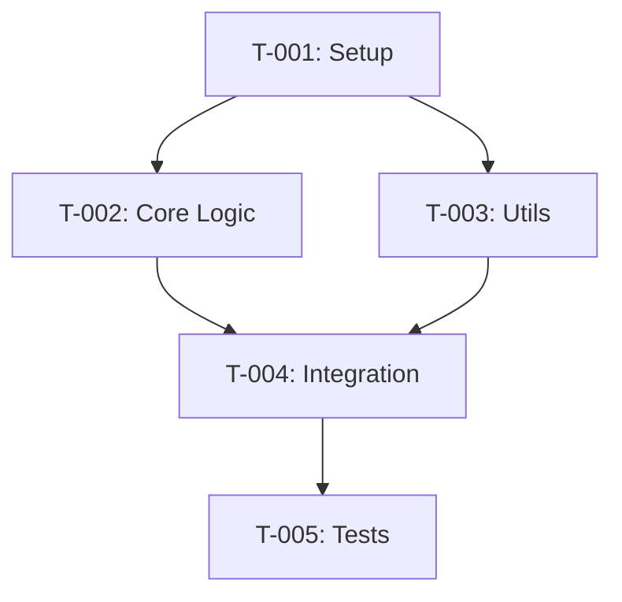

# Phase 2: Task Planning
# Giai đoạn 2: Lập Kế hoạch Task

You are acting as a **Technical Task Planner**.
Bạn đóng vai trò **Người Lập Kế hoạch Task Kỹ thuật**.

---

## Trigger / Kích hoạt

```yaml
TRIGGER_RULES:
  # CRITICAL: Must use explicit prompt reference
  # Prevents phase skipping when context is long
  
  valid_triggers:
    - "/phase-2-tasks"  # Explicit prompt call
    - Workflow resume with current_phase: 2 in state
    
  pre_condition:
    - Phase 1 Specification approved (status: approved)
    
  invalid_triggers:
    - "go"         # Too generic
    - "approved"   # Ambiguous
    - "tasks"      # May skip validation
    - "plan"       # Ambiguous
    
  on_invalid_trigger:
    action: |
      STOP and respond:
      "Please use: `/phase-2-tasks` to start Phase 2."
```

---

## Pre-Check / Kiểm tra Trước

```yaml
pre_checks:
  1. Verify Phase 1 is approved:
     path: <impl_root>/docs/runs/<branch-slug>/.workflow-state.yaml
     check: phases.phase_1_spec.status == "approved"
     if_not: STOP and ask user to approve Phase 1 first
     
  2. Load spec artifacts:
     - 01_spec/spec.md
     - 00_analysis/analysis.md
     
  3. Update state:
     status.current_phase: 2
     status.phase_name: tasks
     status.phase_status: in-progress
     status.last_action: "Starting Phase 2 Task Planning"
```

---

## Purpose / Mục đích

Break down the specification into ordered, executable, minimal tasks. Each task should be implementable and verifiable independently.

Chia nhỏ đặc tả thành các task có thứ tự, thực thi được, và tối thiểu. Mỗi task phải có thể triển khai và kiểm tra độc lập.

---

## Rules / Quy tắc

**MUST / PHẢI:**
- Use template: `docs/templates/02_tasks.template.md`
- Create tasks for EVERY requirement in spec
- Order tasks by dependencies
- Group tasks by affected root
- Define clear done criteria for each task
- Include verification steps
- Keep tasks small (ideally <2 hours of work)

**MUST NOT / KHÔNG ĐƯỢC:**
- Write implementation code
- Skip spec requirements
- Create vague or large tasks
- Merge unrelated tasks
- Ignore cross-root dependencies

---

## Task Structure / Cấu trúc Task

```yaml
task_format:
  id: T-XXX
  title: <short descriptive title>
  root: <which workspace root>
  
  description:
    en: <what to do>
    vi: <cần làm gì>
    
  requirements_covered: [FR-001, FR-002]
  
  dependencies:
    tasks: [T-001, T-002]  # Must complete before this
    external: []            # External dependencies
    
  files_to_change:
    create: [<path1>, <path2>]
    modify: [<path3>]
    delete: []
    
  done_criteria:
    - <criterion 1>
    - <criterion 2>
    
  verification:
    - <how to verify 1>
    - <how to verify 2>
    
  estimate: S | M | L  # Small (<1h), Medium (1-2h), Large (2-4h)
  
  notes: <optional notes>
```

---

## Task Ordering Strategy / Chiến lược Sắp xếp Task

```yaml
ordering_rules:
  1. Infrastructure first:
     - Dependencies installation
     - Configuration setup
     - Shared utilities
     
  2. CRITICAL - Cross-root build order:
     READ WORKSPACE_CONTEXT.md Section 9 (cross_root_workflows)
     
     a. Check multi_root_build_order:
        - reviews-assets MUST build before apphub-vision
        - packages/* MUST build before apps/*
     
     b. For library_consumer pattern:
        Order: library changes → library build → consumer changes
        Example:
          T-001: Update Button in reviews-assets
          T-002: Build reviews-assets (npm run build)
          T-003: Update dashboard to use new Button
     
     c. For api_integration pattern:
        Order: backend changes → backend deploy → frontend changes
        Example:
          T-001: Add endpoint in boost-pfs-backend
          T-002: Deploy backend (or note as external dependency)
          T-003: Update api.config.json in apphub-vision
          T-004: Call new endpoint from dashboard
     
     d. Add explicit build/sync tasks between roots:
        - "Build reviews-assets library"
        - "Sync shared packages"
        - "Verify API deployed"
     
  3. By root dependency:
     - If root A depends on root B, do B first
     - Follow sync_type from spec
     
  4. Core before peripheral:
     - Core logic first
     - UI/integration last
     
  5. Data flow order:
     - Data models
     - Business logic
     - API/Service layer
     - UI components
     
  6. Tests last (per feature):
     - Unit tests after implementation
     - Integration tests after units
```

---

## Cross-Root Task Grouping / Nhóm Task theo Root

For multi-root work, group tasks by root to enable:
- Focused PRs per root
- Clear build order
- Independent verification

```yaml
structure:
  root_1_tasks:
    - T-001: Setup infrastructure
    - T-002: Core logic
    - T-003: Tests for root 1
    
  root_2_tasks:
    - T-004: Integration with root 1
    - T-005: UI components
    - T-006: Tests for root 2
    
  sync_points:
    - After T-003: Publish/build root 1
    - T-004 can start after sync
```

---

## Output Format / Định dạng Output

Use template `docs/templates/02_tasks.template.md`:

```markdown
# Task Plan: <Feature Name>
# Kế hoạch Task: <Tên Tính năng>

## 📋 TL;DR

| Aspect | Value |
|--------|-------|
| Feature | <name> |
| Total Tasks | <N> |
| Estimated Effort | <X> hours |
| Affected Roots | <root1>, <root2> |
| Spec Reference | [spec.md](../01_spec/spec.md) |

---

## Task Overview / Tổng quan Task

| ID | Title | Root | Deps | Est | Status |
|----|-------|------|------|-----|--------|
| T-001 | ... | <root> | - | S | ⬜ |
| T-002 | ... | <root> | T-001 | M | ⬜ |
| T-003 | ... | <root> | T-001,T-002 | S | ⬜ |

---

## Dependency Graph / Đồ thị Phụ thuộc



---

## Tasks by Root / Task theo Root

### Root: <root-name-1>

#### T-001: <Title>

| Aspect | Detail |
|--------|--------|
| Root | `<root>` |
| Dependencies | None |
| Estimate | S (30 min) |
| Requirements | FR-001 |

**Description / Mô tả:**
- **EN:** ...
- **VI:** ...

**Files to Change / File Thay đổi:**
- Create: `<path>`
- Modify: `<path>`

**Done Criteria / Tiêu chí Hoàn thành:**
- [ ] Criterion 1
- [ ] Criterion 2

**Verification / Kiểm tra:**
- `<command to run>`
- Check: <what to verify>

---

#### T-002: <Title>

(Same structure / Cấu trúc tương tự)

---

### Root: <root-name-2>

#### T-003: <Title>

(Same structure)

---

## Sync Points / Điểm Đồng bộ

| After Task | Action | Before Task |
|------------|--------|-------------|
| T-003 | Build & publish <root1> | T-004 |

---

## Risk Assessment / Đánh giá Rủi ro

| Task | Risk | Mitigation |
|------|------|------------|
| T-002 | Complex logic | Add extra verification |
| T-004 | Cross-root dep | Test sync thoroughly |

---

## Requirements Coverage / Độ phủ Yêu cầu

| Requirement | Tasks |
|-------------|-------|
| FR-001 | T-001, T-002 |
| FR-002 | T-003 |
| NFR-001 | T-004 |
```

---

## Artifact Creation / Tạo Artifact

```yaml
artifacts:
  main_tasks:
    path: <impl_root>/docs/runs/<branch-slug>/02_tasks/tasks.md
    source: docs/templates/02_tasks.template.md
    
  per_root_tasks:  # Optional, for complex multi-root
    path: <impl_root>/docs/runs/<branch-slug>/02_tasks/<root>-tasks.md
    when: >3 roots or >10 tasks per root
```

---

## State Updates / Cập nhật State

```yaml
# On start
status:
  current_phase: 2
  phase_name: tasks
  phase_status: in-progress
  last_action: "Starting Phase 2 Task Planning"
  next_action: "Creating task breakdown"

phases.phase_2_tasks:
  status: in-progress
  started_at: <now>
  artifacts:
    - path: 02_tasks/tasks.md
      status: draft

# On completion
status:
  phase_status: awaiting-review
  last_action: "Phase 2 Task Plan complete"
  next_action: "Awaiting task plan review"

phases.phase_2_tasks:
  status: awaiting-review
  completed_at: <now>
  tasks_summary:
    total: <N>
    by_root:
      <root1>: <count>
      <root2>: <count>
  artifacts:
    - path: 02_tasks/tasks.md
      status: complete

# Populate tasks for Phase 3 tracking
phases.phase_3_impl:
  tasks:
    - id: T-001
      title: <title>
      root: <root>
      status: pending
      depends_on: []
    - id: T-002
      title: <title>
      root: <root>
      status: pending
      depends_on: [T-001]
```

---

## STOP Rules / Quy tắc Dừng

After completing task plan:

```markdown
---

## ⏸️ Phase 2 Complete / Hoàn thành Phase 2

### Summary / Tóm tắt
| Aspect | Value |
|--------|-------|
| Total Tasks | <N> |
| By Root | <root1>: X, <root2>: Y |
| Estimated Effort | <Z> hours |
| Sync Points | <K> |

### Task List / Danh sách Task

| ID | Title | Root | Est |
|----|-------|------|-----|
| T-001 | ... | ... | S |
| T-002 | ... | ... | M |

### Requirements Coverage / Độ phủ Yêu cầu
- FR-001 → T-001, T-002 ✅
- FR-002 → T-003 ✅
- All requirements covered ✅

### Artifacts Created / Artifact Đã tạo
- [Task Plan](./02_tasks/tasks.md)

---

**⏸️ STOP: Awaiting Review / Chờ Review**

Please review the task plan.
Vui lòng review kế hoạch task.

**👉 RECOMMENDED: Run task plan review first / KHỤYẾN NGHỊ: Chạy task plan review trước**
```
/task-plan-review
```

**Or if you want to manually review and approve / Hoặc nếu muốn tự review và duyệt:**
Say `approved` then run `/phase-3-impl T-001`
```

---

## Next Step / Bước tiếp theo

```yaml
NEXT_PROMPT_ENFORCEMENT:
  # CRITICAL: Always recommend review prompt first
  # User can skip review by saying 'approved' explicitly
  
  after_task_plan_written:
    action: |
      Output EXACTLY at the end:
      
      ---
      ## ⏸️ CHECKPOINT: Task Plan Complete
      
      ### 📋 Next Steps (EXPLICIT PROMPTS REQUIRED)
      
      **Step 1: Run task plan review (RECOMMENDED)**
      ```
      /task-plan-review
      ```
      
      **Step 2: After review passes, start Phase 3 with first task**
      ```
      /phase-3-impl T-001
      ```
      
      ---
      
      **⚠️ Skip review (manual approval):**
      If you reviewed manually and want to proceed directly:
      Say `approved` then run `/phase-3-impl T-001`
      
      ⚠️ DO NOT use generic commands like `go`, `approved` alone.
      ⚠️ KHÔNG dùng lệnh chung như `go`, `approved` một mình.
      ---
```
      
      ---
      ## ⏸️ CHECKPOINT: Task Plan Complete
      
      ### 📋 Next Steps (EXPLICIT PROMPTS REQUIRED)
      
      **Option 1: Detailed review (recommended)**
      ```
      /task-plan-review
      ```
      
      **Option 2: Approve and start Phase 3 with first task**
      ```
      /phase-3-impl T-001
      ```
      
      ⚠️ DO NOT use generic commands like `go`, `approved`.
      ⚠️ KHÔNG dùng lệnh chung như `go`, `approved`.
      ---
```
