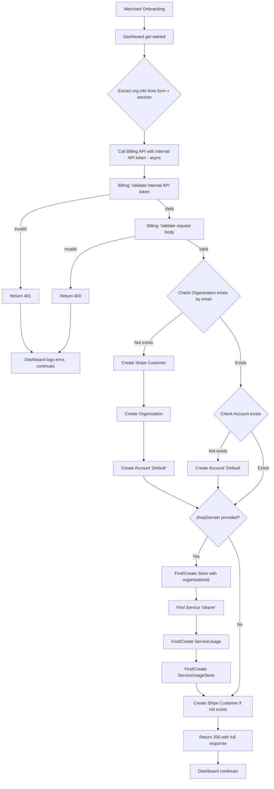

# Technical Feasibility Analysis — BP-24: Billing App Installation Synchronization

> **Purpose:** Technical documentation for developers and reviewers to understand the implementation approach, data flow, and architecture decisions.
>
> **Last Updated:** 2026-01-23
> **Status:** FEASIBLE — High Confidence
> **Revision:** v2 — Updated data model based on PR review feedback

---

# English

## 1. Work Summary

**What is being proposed?**
- Auto-provision billing records (Organisation + Account + Store + ServiceUsage) when a merchant installs the Shopify app
- Track which stores use which **services** via `Service`, `ServiceUsage`, and `ServiceUsageStore` tables
- Create a new internal API endpoint `POST /api/internal/organisation/provision` in Billing app
- Integrate Dashboard's onboarding flow (get-started) to trigger the provisioning

**Why is this work needed?**
- Currently, billing records must be created manually before merchants can be charged
- No automated linkage exists between Shopify app installation and billing system
- This creates operational overhead and delays merchant onboarding

**Key Design Changes (v2):**
- **Account** is now an abstract billing group, NOT directly linked to Store
- **Service** table defines what can be billed (not just apps, but also support, custom work, consulting, etc.)
- **ServiceUsage** links Account → Service (what the account uses) — *replaces the concept of "AppAccount"*
- **ServiceUsageStore** links ServiceUsage → Store (which stores use the service)
- **Store** now belongs directly to Organisation (has `organisationId`)

> **Terminology Note:** We use **"Service"** instead of "App" to have a broader meaning. Billing is not just for app usage (Clearer, Boost) but also for other billable items such as:
> - **Support packages** (premium support, SLA)
> - **Custom development** (theme customization, app customization)
> - **Consulting** (setup assistance, training)
> - **One-time services** (data migration, integration setup)
>
> Therefore, **`ServiceUsage`** replaces the earlier concept of "AppAccount" to provide this flexibility.

---

## 2. High-level Technical Approach

### Key Components

| Component | Location | Role |
|-----------|----------|------|
| Zod Schema | `apps/billing/app/api/internal/organisation/provision/schema.ts` | Request validation |
| ProvisionService | `apps/billing/services/provision.service.ts` | Business logic orchestration |
| ServiceRepository | `apps/billing/lib/repository/prisma/service.repository.ts` | Service & ServiceUsage management |
| StoreRepository | `apps/billing/lib/repository/prisma/store.repository.ts` | Store management |
| Provision Endpoint | `apps/billing/app/api/internal/organisation/provision/route.ts` | API handler with internal API auth |
| Dashboard Helper | `apps/dashboard/helper/billing/provision.ts` | Internal API client call |
| Onboarding Actions | `apps/dashboard/app/(frameless-layout)/get-started/actions.ts` | Integration point |

### Data Flow Overview (v2)

1. Merchant completes onboarding in Dashboard `/get-started`
2. Dashboard extracts org info from form + session (`{ email, name, phone, domain, shopDomain }`)
3. Dashboard calls Billing internal API with internal API token (fire-and-forget)
4. Billing validates token, creates:
   - Stripe Customer (if new org)
   - Organisation (if new)
   - Account "Default" (if new)
   - Store with `organisationId` (if shopDomain provided)
   - ServiceUsage for "Clearer" service
   - ServiceUsageStore linking store to service usage
5. Billing returns result (idempotent)

### Integration Points

- **BP-25 Internal API Authentication:** `BillingInternalAuth`, `getAuthContext()`
- **Stripe API:** `StripeCustomerRepository.createCustomer()`
- **Database:** Prisma client via `@clearer/billing-database`
- **Seed Data:** `Service` table must be seeded before deployment

---

## 3. Technical Flow Diagram



---

## 4. Billing Model Architecture (v2)

```
┌─────────────────────────────────────────────────────────────────────────────┐
│                           BILLING MODEL (v2)                                 │
├─────────────────────────────────────────────────────────────────────────────┤
│                                                                              │
│  Organisation (merchant company)                                             │
│      │                                                                       │
│      ├──── (1:N) ──── Account (abstract billing group)                      │
│      │                   │                                                   │
│      │                   └──── (1:N) ──── ServiceUsage                      │
│      │                                        │                              │
│      │                                        ├── serviceId → Service       │
│      │                                        │                              │
│      │                                        └── (1:N) ──── ServiceUsageStore
│      │                                                           │           │
│      └──── (1:N) ──── Store ◄────────────────────────────────────┘           │
│                                                                              │
│  Service (what can be sold - SEEDED DATA)                                   │
│      • code: "clearer" | "boost" | "support" | "custom-theme"               │
│      • type: "app" | "support" | "custom"                                   │
│      • name: "Clearer App" | "Boost App" | ...                              │
│                                                                              │
└─────────────────────────────────────────────────────────────────────────────┘
```

### Key Relationships

| Relationship | Meaning |
|--------------|---------|
| Organisation → Account | Org can have multiple billing groups |
| Organisation → Store | Org owns the stores directly |
| Account → ServiceUsage | Account uses services (billed here) |
| ServiceUsage → Service | What service is being used |
| ServiceUsage → ServiceUsageStore | Which stores use this service |
| Service (standalone) | Catalog of billable items (seeded) |

---

## 5. API Contract

### Endpoint

```
POST /api/internal/organisation/provision
```

### Authentication

- **Type:** Internal API Token (BP-25)
- **Header:** `Authorization: Bearer bil_<jwt>`
- **Validation:** `getAuthContext(request, { allowUser: false })`

### Request Body

```typescript
{
  email: string;      // Required - lookup key for idempotency
  name: string;       // Required - organisation name
  phone?: string;     // Optional - primary contact phone
  domain?: string;    // Optional - website domain
  shopDomain?: string; // Optional - Shopify store domain
}
```

### Response (v2)

```typescript
// Success (200)
{
  organisation: {
    id: string;
    organisationName: string;
    primaryContactEmail: string | null;
    primaryContactPhone: string | null;
    stripeCustomerId: string;
    stripeRegion: 'uk';
    testMode: boolean;
  };
  account: {
    id: string;
    organisationId: string;
    accountName: string;
  };
  store?: {
    id: string;
    organisationId: string;
    shopDomain: string;
    shopName: string | null;
    platform: 'shopify';
  };
  serviceUsage?: {
    id: string;
    accountId: string;
    serviceId: string;
    service: {
      code: string;
      name: string;
      type: string;
    };
  };
  created: boolean;        // true if org newly created
  storeCreated: boolean;   // true if store newly created
  serviceUsageCreated: boolean; // true if service usage newly created
}

// Errors
// 400: Invalid request body
// 401: Invalid/missing internal API token
// 500: Internal error (Stripe/DB failure)
```

---

## 6. Database Models (v2)

### Organisation (existing - unchanged)

```prisma
model Organisation {
  id                  String       @id @default(uuid())
  organisationName    String       @map("organisation_name")
  primaryContactName  String?      @map("primary_contact_name")
  primaryContactEmail String?      @map("primary_contact_email")  // ← lookup key
  primaryContactPhone String?      @map("primary_contact_phone")
  stripeCustomerId    String       @unique @map("stripe_customer_id")
  stripeRegion        StripeRegion @map("stripe_region")
  testMode            Boolean      @default(false) @map("test_mode")
  
  accounts Account[]
  stores   Store[]     // NEW: direct relationship
}
```

### Account (existing - unchanged conceptually)

```prisma
model Account {
  id             String   @id @default(uuid())
  organisationId String   @map("organisation_id")
  accountName    String   @map("account_name")  // ← default: "Default"
  notes          String?  @db.Text
  
  organisation   Organisation    @relation(...)
  serviceUsages  ServiceUsage[]  // NEW: relationship
}
```

### Store (UPDATED - now belongs to Organisation)

```prisma
model Store {
  id             String   @id @default(uuid())
  organisationId String   @map("organisation_id")  // NEW: direct ownership
  shopDomain     String   @unique @map("shop_domain")
  shopName       String?  @map("shop_name")
  platform       String   @default("shopify")
  createdAt      DateTime @default(now()) @map("created_at")
  updatedAt      DateTime @updatedAt @map("updated_at")
  
  organisation   Organisation        @relation(...)
  serviceUsages  ServiceUsageStore[] // NEW: relationship
}
```

### Service (NEW - seeded lookup table)

```prisma
/// Defines what can be sold/billed
/// This is a lookup table that should be seeded before deployment
model Service {
  id        String   @id @default(uuid())
  code      String   @unique  // "clearer", "boost", "support", "custom-theme"
  name      String            // "Clearer App", "Boost App", etc.
  type      String            // "app", "support", "custom"
  createdAt DateTime @default(now()) @map("created_at")
  updatedAt DateTime @updatedAt @map("updated_at")
  
  serviceUsages ServiceUsage[]
  
  @@map("service")
}
```

### ServiceUsage (NEW - replaces StoreAccountLink)

```prisma
/// Tracks which Account uses which Service
/// This is where billing is attributed
model ServiceUsage {
  id        String   @id @default(uuid())
  accountId String   @map("account_id")
  serviceId String   @map("service_id")
  createdAt DateTime @default(now()) @map("created_at")
  updatedAt DateTime @updatedAt @map("updated_at")
  
  account Account @relation(...)
  service Service @relation(...)
  stores  ServiceUsageStore[]
  
  @@unique([accountId, serviceId], name: "unique_account_service")
  @@map("service_usage")
}
```

### ServiceUsageStore (NEW - links stores to service usage)

```prisma
/// Tracks which Stores are associated with a ServiceUsage
/// For app services, this shows which stores use the app
model ServiceUsageStore {
  id             String   @id @default(uuid())
  serviceUsageId String   @map("service_usage_id")
  storeId        String   @map("store_id")
  createdAt      DateTime @default(now()) @map("created_at")
  
  serviceUsage ServiceUsage @relation(...)
  store        Store        @relation(...)
  
  @@unique([serviceUsageId, storeId], name: "unique_usage_store")
  @@map("service_usage_store")
}
```

### StoreAccountLink (DEPRECATED - to be removed)

The old `StoreAccountLink` model is replaced by the new `ServiceUsage` + `ServiceUsageStore` models.

---

## 7. Seed Data (REQUIRED)

### Service Table Seed

The `Service` table must be seeded before the application can provision billing records.

```typescript
// prisma/seed/services.ts
const services = [
  { code: 'clearer', name: 'Clearer App', type: 'app' },
  { code: 'boost', name: 'Boost App', type: 'app' },
  { code: 'support', name: 'Support Package', type: 'support' },
  { code: 'custom-theme', name: 'Theme Customization', type: 'custom' },
];
```

### Deployment Checklist

⚠️ **IMPORTANT:** Before deploying to any environment:
1. Run database migration
2. Run seed script for `Service` table
3. Verify seed data exists

See `packages/billing-database/README.md` for seed commands.

---

## 8. Field Mapping

| Source (Request Body) | Target (Organisation) |
|--------------------|-----------------------|
| `org.email` | `primaryContactEmail` (lookup key) |
| `org.name` | `organisationName` |
| `org.phone` | `primaryContactPhone` |
| `org.domain` | _(stored for future use)_ |
| `org.shopDomain` | `Store.shopDomain` |

### Defaults

| Field | Value | Source |
|-------|-------|--------|
| `stripeRegion` | `'uk'` | Hardcoded default |
| `testMode` | `true/false` | `process.env.NODE_ENV !== 'production'` |
| `accountName` | `'Default'` | Hardcoded default |
| `Service.code` | `'clearer'` | Hardcoded for app provisioning |

---

## 9. Preconditions

### Required System State

- [x] BP-25 internal API authentication merged and functional
- [x] `BillingInternalAuth` and `getAuthContext()` available in Billing app
- [x] Billing database schema has Organisation and Account models
- [x] `StripeClient` and `StripeCustomerRepository` exist
- [ ] **NEW:** `Service` table seeded with initial data

### Required Environment Variables

| Variable | App | Purpose |
|----------|-----|---------|
| `BILLING_AUTH_SECRET` | Dashboard, Billing | Internal API token signing/verification |
| `BILLING_INTERNAL_API_URL` | Dashboard | Billing service URL |
| `STRIPE_US_TEST_SECRET_KEY` | Billing | Stripe API (test mode) |
| `STRIPE_US_LIVE_SECRET_KEY` | Billing | Stripe API (live mode) |

---

## 10. Risks & Mitigations

### Risk 1: Orphaned Stripe Customer

**Scenario:** Stripe Customer created but Organisation creation fails

**Mitigation:**
- Log Stripe customer ID in error for manual cleanup
- Consider saga pattern in future enhancement

### Risk 2: No Unique Constraint on Email

**Scenario:** `primaryContactEmail` has no unique constraint in schema

**Mitigation:**
- Application-level check first (lookup by email)
- `stripeCustomerId` unique constraint prevents duplicates
- Consider adding unique constraint in future migration

### Risk 3: Concurrent Requests

**Scenario:** Two requests for same email arrive simultaneously

**Mitigation:**
- Database unique constraint on `stripeCustomerId` prevents duplicates
- Second request will find existing org and return it

### Risk 4: Billing App Unavailable

**Scenario:** Billing app down during onboarding

**Mitigation:**
- Fire-and-forget pattern: Dashboard continues onboarding
- Failure logged for later review
- Fallback provisioning on subsequent visits

### Risk 5: Service Table Not Seeded

**Scenario:** Provision fails because 'clearer' service doesn't exist

**Mitigation:**
- Add seed script to deployment pipeline
- Log clear error message if service not found
- Document seed requirement in README

---

## 11. Edge Cases

| Case | Behavior |
|------|----------|
| Duplicate email | Return existing Organisation + Account |
| Stripe API failure | Log error, return 500, Dashboard continues |
| DB failure after Stripe customer created | Log with Stripe ID for cleanup |
| Internal API token expired | Return 401, Dashboard logs and continues |
| Missing required fields | Return 400 with validation errors |
| Account already exists | Skip creation, return existing |
| Store already exists for org | Use existing store |
| Store exists for different org | Error - shopDomain must be unique |
| Service 'clearer' not found | Error 500 - seed required |
| ServiceUsage already exists | Skip creation, return existing |
| No shopDomain provided | Skip store/service usage creation |

---

## 12. Example Data Flow

### Example: New Merchant with Store

**Input:**
```json
{
  "email": "merchant@acme.com",
  "name": "Acme Inc",
  "phone": "+1234567890",
  "domain": "acme.com",
  "shopDomain": "acme-store.myshopify.com"
}
```

**Database records created:**
```sql
-- 1. Organisation
INSERT INTO organisation (id, organisation_name, primary_contact_email, stripe_customer_id, ...)
VALUES ('org-1', 'Acme Inc', 'merchant@acme.com', 'cus_xxx', ...);

-- 2. Account
INSERT INTO account (id, organisation_id, account_name)
VALUES ('acc-1', 'org-1', 'Default');

-- 3. Store (belongs to Org)
INSERT INTO store (id, organisation_id, shop_domain, platform)
VALUES ('store-1', 'org-1', 'acme-store.myshopify.com', 'shopify');

-- 4. ServiceUsage (Account uses Clearer)
INSERT INTO service_usage (id, account_id, service_id)
VALUES ('su-1', 'acc-1', 'service-clearer');

-- 5. ServiceUsageStore (Store linked to usage)
INSERT INTO service_usage_store (id, service_usage_id, store_id)
VALUES ('sus-1', 'su-1', 'store-1');
```

---

## 13. Implementation Tasks (Updated)

| Task | Description | Status |
|------|-------------|--------|
| 1 | Update Zod schema (add shopDomain) | ✅ Complete |
| 2 | Update Prisma schema (new models) | 🔄 In Progress |
| 3 | Create seed script for Service table | ⏳ Pending |
| 4 | Update ProvisionService logic | ⏳ Pending |
| 5 | Create ServiceRepository | ⏳ Pending |
| 6 | Update provision API endpoint | ⏳ Pending |
| 7 | Update Dashboard helper | ✅ Complete |
| 8 | Update unit tests | ⏳ Pending |
| 9 | Update README with seed instructions | ⏳ Pending |

---

## 14. Feasibility Verdict

| Aspect | Assessment |
|--------|------------|
| **Verdict** | **FEASIBLE** |
| **Confidence** | **High** |
| **Technical Complexity** | Medium (model changes) |
| **Risk Level** | Low-Medium |

**Rationale:**
- All required infrastructure exists
- Pattern is established and tested (BP-25)
- Model changes are additive (backward compatible)
- Seed data requirement is manageable

---

# Tiếng Việt

## 1. Tóm tắt công việc

**Đề xuất:**
- Tự động tạo billing records (Organisation + Account + Store + ServiceUsage) khi merchant hoàn thành onboarding
- Theo dõi store sử dụng **service** nào qua `Service`, `ServiceUsage`, và `ServiceUsageStore`
- Tạo internal API endpoint mới `POST /api/internal/organisation/provision` trong Billing app
- Tích hợp Dashboard onboarding flow (get-started) để trigger provisioning

**Thay đổi thiết kế chính (v2):**
- **Account** là billing group trừu tượng, KHÔNG link trực tiếp với Store
- **Service** định nghĩa cái gì có thể billing (không chỉ apps, mà còn support, custom work, consulting...)
- **ServiceUsage** link Account → Service (account sử dụng gì) — *thay thế khái niệm "AppAccount"*
- **ServiceUsageStore** link ServiceUsage → Store (store nào sử dụng service)
- **Store** thuộc trực tiếp Organisation (có `organisationId`)

> **Ghi chú thuật ngữ:** Chúng tôi sử dụng **"Service"** thay vì "App" để có ý nghĩa rộng hơn. Billing không chỉ dành cho việc sử dụng app (Clearer, Boost) mà còn cho các dịch vụ phát sinh khác như:
> - **Support packages** (hỗ trợ premium, SLA)
> - **Custom development** (tùy chỉnh theme, tùy chỉnh app)
> - **Consulting** (hỗ trợ setup, training)
> - **One-time services** (data migration, integration setup)
>
> Do đó, **`ServiceUsage`** thay thế cho khái niệm "AppAccount" để cung cấp sự linh hoạt này.

---

## 2. Kiến trúc Billing Model (v2)

```
Organisation (merchant company)
    │
    ├──── (1:N) ──── Account (billing group trừu tượng)
    │                   │
    │                   └──── (1:N) ──── ServiceUsage
    │                                        │
    │                                        ├── serviceId → Service
    │                                        │
    │                                        └── (1:N) ──── ServiceUsageStore
    │                                                           │
    └──── (1:N) ──── Store ◄────────────────────────────────────┘

Service (bảng lookup - SEED DATA)
    • code: "clearer" | "boost" | "support" | "custom-theme"
    • type: "app" | "support" | "custom"
```

---

## 3. Seed Data (BẮT BUỘC)

⚠️ **QUAN TRỌNG:** Trước khi deploy lên bất kỳ môi trường nào:
1. Chạy database migration
2. Chạy seed script cho bảng `Service`
3. Kiểm tra seed data tồn tại

### Services cần seed:

| code | name | type |
|------|------|------|
| clearer | Clearer App | app |
| boost | Boost App | app |
| support | Support Package | support |
| custom-theme | Theme Customization | custom |

---

## 4. Rủi ro & Giảm thiểu

| Rủi ro | Giảm thiểu |
|--------|------------|
| Stripe Customer tạo nhưng Organisation fail | Log Stripe ID để cleanup thủ công |
| Concurrent requests | Database unique constraint ngăn duplicates |
| Billing app không khả dụng | Fire-and-forget, Dashboard tiếp tục |
| Service table chưa seed | Log error rõ ràng, document seed requirement |
| Store đã tồn tại cho org khác | Reject - shopDomain phải unique |

---

## 5. Kết luận

| | |
|---|---|
| **Kết luận** | **CÓ THỂ LÀM** |
| **Mức độ tự tin** | **Cao** |
| **Độ phức tạp** | Trung bình (do thay đổi model) |
| **Mức độ rủi ro** | Thấp-Trung bình |
