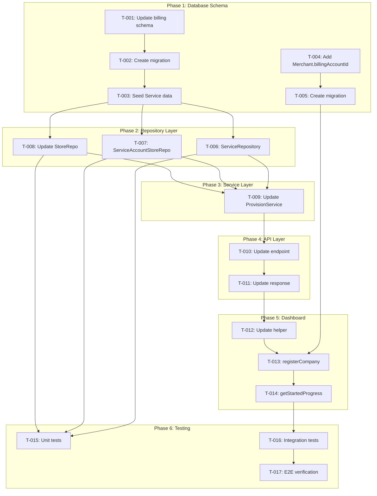

# Task Plan Update #1 — BP-24: Billing App Installation Synchronization
<!-- Task Plan for Update #1 based on spec-update-1.md -->
<!-- Data Model Changes: Service-Based Architecture -->

---

## TL;DR

| Aspect | Value |
|--------|-------|
| Feature | BP-24 Update #1: Data Model Refinement |
| Update Type | PR_REVIEW |
| Total Tasks | 17 |
| Estimated Effort | 18-22 hours |
| Affected Roots | apphub-vision |
| Spec Reference | [spec-update-1.md](../01_spec/spec-update-1.md) |

---

## 1. Goal / Mục tiêu

🇻🇳 **Mục tiêu:**
Cập nhật billing provisioning flow với data model refinement từ PR review:
- Loại bỏ Product và ServiceUsageStore models
- Đổi tên ServiceUsage → ServiceAccountStore
- Thêm Service model với seed data
- Store thuộc trực tiếp Organisation (organisationId FK)
- Dashboard lưu accountId vào Merchant table để sử dụng khi gọi Billing API

🇬🇧 **Goal:**
Update billing provisioning flow with data model refinement from PR review:
- Remove Product and ServiceUsageStore models
- Rename ServiceUsage → ServiceAccountStore
- Add Service model with seed data
- Store belongs directly to Organisation (organisationId FK)
- Dashboard persists accountId to Merchant table for Billing API calls

---

## 2. Task Overview / Tổng quan Task

| ID | Title | Root | Type | Est. | Deps | Status |
|----|-------|------|------|------|------|--------|
| **Phase 1: Database Schema Changes** | | | | | | |
| T-001 | Update billing-database Prisma schema | apphub-vision | Modify | 1.5h | - | ⏳ |
| T-002 | Create Prisma migration for schema changes | apphub-vision | New | 1h | T-001 | ⏳ |
| T-003 | Create Service seed script | apphub-vision | New | 0.5h | T-002 | ⏳ |
| T-004 | Add billingAccountId to Merchant in app-database | apphub-vision | Modify | 0.5h | - | ⏳ |
| T-005 | Create Prisma migration for Merchant.billingAccountId | apphub-vision | New | 0.5h | T-004 | ⏳ |
| **Phase 2: Repository Layer Updates** | | | | | | |
| T-006 | Create ServiceRepository | apphub-vision | New | 1h | T-003 | ⏳ |
| T-007 | Rename ServiceUsageRepository → ServiceAccountStoreRepository | apphub-vision | Modify | 1h | T-003 | ⏳ |
| T-008 | Update StoreRepository for organisationId | apphub-vision | Modify | 0.5h | T-003 | ⏳ |
| **Phase 3: Service Layer Updates** | | | | | | |
| T-009 | Update ProvisionService for new data model | apphub-vision | Modify | 2h | T-006,T-007,T-008 | ⏳ |
| **Phase 4: API Layer Updates** | | | | | | |
| T-010 | Update provision endpoint path validation | apphub-vision | Modify | 0.5h | T-009 | ⏳ |
| T-011 | Update provision response schema with accountId | apphub-vision | Modify | 0.5h | T-010 | ⏳ |
| **Phase 5: Dashboard Integration** | | | | | | |
| T-012 | Update provisionBillingOrganisationAsync helper | apphub-vision | Modify | 1h | T-011 | ⏳ |
| T-013 | Update registerCompany to persist accountId | apphub-vision | Modify | 1h | T-005,T-012 | ⏳ |
| T-014 | Update getStartedProgress fallback to persist accountId | apphub-vision | Modify | 0.5h | T-013 | ⏳ |
| **Phase 6: Testing & Verification** | | | | | | |
| T-015 | Update unit tests for repositories | apphub-vision | Modify | 2h | T-006,T-007,T-008 | ⏳ |
| T-016 | Update integration tests for provision flow | apphub-vision | Modify | 2h | T-014 | ⏳ |
| T-017 | Manual E2E verification | apphub-vision | Verify | 1h | T-016 | ⏳ |

**Legend:**
- Type: `New` = Create new, `Modify` = Change existing, `Verify` = Manual testing
- Status: ⏳ Pending, 🔄 In Progress, ✅ Done, ❌ Blocked
- Est.: Estimated time in hours

---

## 3. Execution Flow / Luồng Thực thi



---

## 4. Task Details / Chi tiết Task

### Phase 1: Database Schema Changes

---

#### T-001 — Update billing-database Prisma schema

| Aspect | Detail |
|--------|--------|
| Root | `apphub-vision` |
| Type | Modify |
| Estimated | 1.5h |
| Dependencies | None |
| FR Covered | FR-005, FR-006, FR-007, FR-013 |

**Description / Mô tả:**

🇻🇳 Cập nhật Prisma schema trong billing-database để phản ánh data model mới:
- ✅ Service model đã tồn tại → Thêm relationships thiếu (pricePlans, entitlements, usageMeters)
- ✅ Store.organisationId đã có → Giữ nguyên
- 🔄 Đổi tên ServiceUsage → ServiceAccountStore + consolidate với ServiceUsageStore
- 🔄 Thêm nullable serviceId vào PricePlan, Entitlement, UsageMeter (backward compatible)
- ⏳ Mark Product, ServiceUsageStore deprecated (chờ confirm từ dev team trước khi xóa)

🇬🇧 Update Prisma schema in billing-database to reflect new data model:
- ✅ Service model exists → Add missing relationships (pricePlans, entitlements, usageMeters)
- ✅ Store.organisationId exists → Keep as is
- 🔄 Rename ServiceUsage → ServiceAccountStore + consolidate with ServiceUsageStore
- 🔄 Add nullable serviceId to PricePlan, Entitlement, UsageMeter (backward compatible)
- ⏳ Mark Product, ServiceUsageStore deprecated (await dev team confirmation before removal)

---

**⚠️ TODO: Cần Confirm với Dev Team**

**Models cần review trước khi xóa Product:**

1. **PricePlan.productId vs serviceId**
   - ❓ PricePlan hiện tại có đang dùng Product không?
   - ❓ Có data production reference Product không?
   - ❓ Logic billing có depend on Product.slug hay Product.id?
   - **Current approach**: Add nullable serviceId, keep productId (backward compatible)
   - **After confirmation**: Migrate data productId → serviceId, then remove productId

2. **Entitlement.productId vs serviceId**
   - ❓ Entitlements đang được assign theo Product hay Service?
   - ❓ Có feature flags depend on Product không?
   - **Current approach**: Add nullable serviceId, keep productId
   - **After confirmation**: Decide migration path

3. **UsageMeter.productId vs serviceId**
   - ❓ Usage tracking hiện tại track theo Product hay Service?
   - ❓ Stripe Billing Meter có integrate với Product không?
   - **Current approach**: Add nullable serviceId, keep productId
   - **After confirmation**: Decide migration path

**Contact**: Team lead cần confirm với dev team về các models này trước T-002 (migration)

**Timeline**: Cần answer trước khi chạy migration trong T-002

**Files / File Thay đổi:**

| Action | Path |
|--------|------|
| Modify | `packages/billing-database/prisma/schema.prisma` |

**Implementation / Triển khai:**

**Phase 1: Add Service relationships (safe, non-breaking)**

```prisma
// 1. Update Service model - Add missing relationships
model Service {
  id          String      @id @default(uuid())
  code        String      @unique
  name        String
  type        ServiceType
  description String?     @db.Text
  createdAt   DateTime    @default(now()) @map("created_at")
  updatedAt   DateTime    @updatedAt @map("updated_at")

  // Relationships
  serviceUsages ServiceAccountStore[]  // Will rename from ServiceUsage
  pricePlans    PricePlan[]           // NEW - from Product
  entitlements  Entitlement[]         // NEW - from Product
  usageMeters   UsageMeter[]          // NEW - from Product

  @@index([type])
  @@map("service")
}
```

**Phase 2: Rename ServiceUsage → ServiceAccountStore (consolidate with ServiceUsageStore)**

```prisma
// 2. Rename ServiceUsage → ServiceAccountStore
// Consolidate: Add storeId directly, remove need for ServiceUsageStore
model ServiceAccountStore {
  id        String   @id @default(uuid())
  accountId String   @map("account_id")
  serviceId String   @map("service_id")
  storeId   String   @map("store_id")     // NEW - from ServiceUsageStore
  linkedAt  DateTime @default(now()) @map("linked_at")  // NEW - renamed from createdAt
  isActive  Boolean  @default(true) @map("is_active")   // NEW
  createdAt DateTime @default(now()) @map("created_at")
  updatedAt DateTime @updatedAt @map("updated_at")

  // Relationships
  account Account @relation(fields: [accountId], references: [id], onDelete: Cascade)
  service Service @relation(fields: [serviceId], references: [id], onDelete: Cascade)
  store   Store   @relation(fields: [storeId], references: [id], onDelete: Cascade)  // NEW

  @@unique([accountId, serviceId, storeId])  // NEW - consolidate constraint
  @@index([accountId])
  @@index([serviceId])
  @@index([storeId])  // NEW
  @@map("service_account_store")  // NEW table name
}
```

**Phase 3: Add serviceId to models (backward compatible - keep productId)**

```prisma
// 3. Update PricePlan - Add optional serviceId
model PricePlan {
  id        String   @id @default(uuid())
  productId String?  @map("product_id")  // Make nullable (was required)
  serviceId String?  @map("service_id")  // NEW - nullable for migration
  slug      String   @unique
  title     String
  isActive  Boolean  @default(true) @map("is_active")
  createdAt DateTime @default(now()) @map("created_at")
  updatedAt DateTime @updatedAt @map("updated_at")

  // Relationships
  product               Product?             @relation(fields: [productId], references: [id], onDelete: Cascade)
  service               Service?             @relation(fields: [serviceId], references: [id], onDelete: Cascade)  // NEW
  pricePlanOptions      PricePlanOption[]
  pricePlanEntitlements PricePlanEntitlement[]
  stripeProducts        StripeProduct[]

  @@index([productId])
  @@index([serviceId])  // NEW
  @@index([isActive])
  @@map("price_plan")
}

// 4. Update Entitlement - Add optional serviceId
model Entitlement {
  id        String   @id @default(uuid())
  productId String?  @map("product_id")  // Make nullable
  serviceId String?  @map("service_id")  // NEW
  title     String
  slug      String   @unique
  createdAt DateTime @default(now()) @map("created_at")
  updatedAt DateTime @updatedAt @map("updated_at")

  // Relationships
  product               Product?             @relation(fields: [productId], references: [id], onDelete: Cascade)
  service               Service?             @relation(fields: [serviceId], references: [id], onDelete: Cascade)  // NEW
  pricePlanEntitlements PricePlanEntitlement[]
  accountEntitlements   AccountEntitlement[]

  @@index([productId])
  @@index([serviceId])  // NEW
  @@map("entitlement")
}

// 5. Update UsageMeter - Add optional serviceId
model UsageMeter {
  id                 String             @id @default(uuid())
  productId          String?            @map("product_id")  // Make nullable
  serviceId          String?            @map("service_id")  // NEW
  slug               String             @unique
  displayName        String             @map("display_name")
  eventName          String             @map("event_name")
  aggregationFormula AggregationFormula @map("aggregation_formula")
  valueType          ValueType          @default(count) @map("value_type")
  currency           String?
  description        String?            @db.Text
  isActive           Boolean            @default(true) @map("is_active")
  createdAt          DateTime           @default(now()) @map("created_at")
  updatedAt          DateTime           @updatedAt @map("updated_at")

  // Relationships
  product             Product?             @relation(fields: [productId], references: [id], onDelete: Cascade)
  service             Service?             @relation(fields: [serviceId], references: [id], onDelete: Cascade)  // NEW
  stripeBillingMeters StripeBillingMeter[]
  subscriptionUsages  SubscriptionUsage[]

  @@index([productId])
  @@index([serviceId])  // NEW
  @@index([slug])
  @@map("usage_meter")
}
```

**Phase 4: Update model relations**

```prisma
// 6. Update Account relation
model Account {
  // ... existing fields ...
  
  // Relationships
  organisation        Organisation         @relation(...)
  accountEntitlements AccountEntitlement[]
  stripeSubscriptions StripeSubscription[]
  serviceUsages       ServiceAccountStore[]  // RENAMED from ServiceUsage[]
  
  // ... rest unchanged ...
}

// 7. Update Store relation
model Store {
  // ... existing fields ...
  
  // Relationships
  organisation         Organisation?         @relation(...)
  serviceAccountStores ServiceAccountStore[] // RENAMED from serviceUsageStores ServiceUsageStore[]
  
  // ... rest unchanged ...
}
```

**Phase 5: Mark deprecated models (keep for now, remove after data migration)**

```prisma
// DEPRECATED: Will be removed after data migration to Service model
// All new features should use Service instead of Product
// TODO: Contact dev team to confirm:
//   - Are PricePlans currently using Product?
//   - Timeline for productId → serviceId migration?
//   - Any active Product references in production?
model Product {
  // ... keep existing structure unchanged ...
}

// DEPRECATED: Consolidated into ServiceAccountStore
// Will be removed after data migration in T-002
// This model is replaced by adding storeId directly to ServiceAccountStore
model ServiceUsageStore {
  // ... keep existing structure unchanged ...
}
```

**Done Criteria / Tiêu chí Hoàn thành:**

- [ ] Service model: Add pricePlans[], entitlements[], usageMeters[] relationships
- [ ] ServiceUsage renamed to ServiceAccountStore
- [ ] ServiceAccountStore: Add storeId, linkedAt, isActive fields
- [ ] ServiceAccountStore: Update unique constraint to (accountId, serviceId, storeId)
- [ ] PricePlan: Add nullable serviceId + Service? relation, make productId nullable
- [ ] Entitlement: Add nullable serviceId + Service? relation, make productId nullable
- [ ] UsageMeter: Add nullable serviceId + Service? relation, make productId nullable
- [ ] Account.serviceUsages relation updated to ServiceAccountStore[]
- [ ] Store.serviceAccountStores relation updated to ServiceAccountStore[]
- [ ] Product model marked DEPRECATED with TODO comment
- [ ] ServiceUsageStore model marked DEPRECATED with TODO comment
- [ ] Schema passes `pnpm --filter @clearer/billing-database prisma validate`
- [ ] TODO notes added for dev team confirmation

**Notes:**
- ⚠️ Product và ServiceUsageStore models giữ lại (mark deprecated) chờ confirm từ dev team
- ⚠️ PricePlan/Entitlement/UsageMeter có cả productId và serviceId (backward compatible)
- ✅ Migration T-002 sẽ dựa trên kết quả confirm từ dev team

**Verification / Kiểm tra:**

```bash
cd packages/billing-database
pnpm prisma validate
pnpm prisma format  # Auto-format schema
```

---

#### T-002 — Create Prisma migration for schema changes

| Aspect | Detail |
|--------|--------|
| Root | `apphub-vision` |
| Type | New |
| Estimated | 1h |
| Dependencies | T-001 |
| FR Covered | FR-005, FR-006, FR-007 |

**Description / Mô tả:**

🇻🇳 Tạo Prisma migration để apply schema changes vào database. Migration phải handle việc drop old tables, rename, và create new tables.

🇬🇧 Create Prisma migration to apply schema changes to database. Migration must handle dropping old tables, renaming, and creating new tables.

**Files / File Thay đổi:**

| Action | Path |
|--------|------|
| Create | `packages/billing-database/prisma/migrations/<timestamp>_update_data_model/migration.sql` |

**Implementation / Triển khai:**

```bash
cd packages/billing-database
pnpm prisma migrate dev --name update_data_model_service_based
```

🇻🇳 **Lưu ý quan trọng:**
- Review generated migration SQL before applying
- Nếu có existing data, cần thêm data migration steps manually
- Test migration trên dev database trước
- Migration sẽ drop Product và ServiceUsageStore tables (mất data nếu có)

🇬🇧 **Important notes:**
- Review generated migration SQL before applying
- If existing data exists, need to add data migration steps manually
- Test migration on dev database first
- Migration will drop Product and ServiceUsageStore tables (data loss if exists)

**Done Criteria / Tiêu chí Hoàn thành:**

- [ ] Migration file created successfully
- [ ] Migration SQL reviewed and verified
- [ ] Migration applied to local dev database
- [ ] Database schema matches Prisma schema after migration
- [ ] No errors when running migration

**Verification / Kiểm tra:**

```bash
# Apply migration
pnpm prisma migrate dev

# Verify schema
pnpm prisma db pull  # Should match schema.prisma
pnpm prisma validate

# Check database directly
pnpm prisma studio  # Visually verify tables
```

---

#### T-003 — Create Service seed script

| Aspect | Detail |
|--------|--------|
| Root | `apphub-vision` |
| Type | New |
| Estimated | 0.5h |
| Dependencies | T-002 |
| FR Covered | FR-005 |

**Description / Mô tả:**

🇻🇳 Tạo seed script để populate Service table với các services mặc định: "clearer", "boost", "support", "custom-theme".

🇬🇧 Create seed script to populate Service table with default services: "clearer", "boost", "support", "custom-theme".

**Files / File Thay đổi:**

| Action | Path |
|--------|------|
| Create | `packages/billing-database/prisma/seed/services.ts` |
| Modify | `packages/billing-database/prisma/seed.ts` (import and call) |

**Implementation / Triển khai:**

```typescript
// packages/billing-database/prisma/seed/services.ts
import { PrismaClient } from '@prisma/client';

const prisma = new PrismaClient();

export async function seedServices() {
  const services = [
    {
      name: 'clearer',
      displayName: 'Clearer App',
      description: 'AI-powered customer support and engagement platform',
      isActive: true,
    },
    {
      name: 'boost',
      displayName: 'Boost App',
      description: 'Product filtering and search enhancement',
      isActive: true,
    },
    {
      name: 'support',
      displayName: 'Premium Support',
      description: 'Dedicated support and SLA packages',
      isActive: true,
    },
    {
      name: 'custom-theme',
      displayName: 'Custom Theme Development',
      description: 'Custom theme development and customization services',
      isActive: true,
    },
  ];

  for (const service of services) {
    await prisma.service.upsert({
      where: { name: service.name },
      update: service,
      create: service,
    });
  }

  console.log('✅ Services seeded');
}
```

**Done Criteria / Tiêu chí Hoàn thành:**

- [ ] Seed script created with 4 services
- [ ] Script uses upsert for idempotency
- [ ] Script integrated into main seed.ts
- [ ] Seed runs successfully: `pnpm prisma db seed`
- [ ] Verify 4 services exist in database

**Verification / Kiểm tra:**

```bash
cd packages/billing-database
pnpm prisma db seed

# Verify in Prisma Studio
pnpm prisma studio
# Check services table - should have 4 rows
```

---

#### T-004 — Add billingAccountId to Merchant in app-database

| Aspect | Detail |
|--------|--------|
| Root | `apphub-vision` |
| Type | Modify |
| Estimated | 0.5h |
| Dependencies | None (parallel with T-001) |
| FR Covered | FR-010 |

**Description / Mô tả:**

🇻🇳 Thêm field `billingAccountId` vào Merchant model trong app-database để lưu Account ID từ Billing app.

🇬🇧 Add field `billingAccountId` to Merchant model in app-database to store Account ID from Billing app.

**Files / File Thay đổi:**

| Action | Path |
|--------|------|
| Modify | `packages/app-database/prisma/schema.prisma` |

**Implementation / Triển khai:**

```prisma
model Merchant {
  // ... existing fields
  billingAccountId String? // UUID from Billing app, nullable for backward compatibility
  
  // ... rest of model
}
```

**Done Criteria / Tiêu chí Hoàn thành:**

- [ ] Field added to Merchant model
- [ ] Field is nullable (String?)
- [ ] Schema validates: `pnpm --filter @clearer/app-database prisma validate`

**Verification / Kiểm tra:**

```bash
cd packages/app-database
pnpm prisma validate
pnpm prisma format
```

---

#### T-005 — Create Prisma migration for Merchant.billingAccountId

| Aspect | Detail |
|--------|--------|
| Root | `apphub-vision` |
| Type | New |
| Estimated | 0.5h |
| Dependencies | T-004 |
| FR Covered | FR-010 |

**Description / Mô tả:**

🇻🇳 Tạo Prisma migration để add billingAccountId column vào Merchant table.

🇬🇧 Create Prisma migration to add billingAccountId column to Merchant table.

**Files / File Thay đổi:**

| Action | Path |
|--------|------|
| Create | `packages/app-database/prisma/migrations/<timestamp>_add_billing_account_id/migration.sql` |

**Implementation / Triển khai:**

```bash
cd packages/app-database
pnpm prisma migrate dev --name add_billing_account_id
```

**Done Criteria / Tiêu chí Hoàn thành:**

- [ ] Migration created successfully
- [ ] Migration adds nullable billingAccountId column
- [ ] Migration applied to local dev database
- [ ] Existing Merchant records unaffected (NULL values)

**Verification / Kiểm tra:**

```bash
pnpm prisma migrate dev
pnpm prisma db pull  # Verify schema matches
pnpm prisma studio  # Check Merchant table has new column
```

---

### Phase 2: Repository Layer Updates

---

#### T-006 — Create ServiceRepository

| Aspect | Detail |
|--------|--------|
| Root | `apphub-vision` |
| Type | New |
| Estimated | 1h |
| Dependencies | T-003 |
| FR Covered | FR-005 |

**Description / Mô tả:**

🇻🇳 Tạo ServiceRepository để quản lý CRUD operations cho Service model. Repository chỉ cần read operations vì Service là seed data.

🇬🇧 Create ServiceRepository to manage CRUD operations for Service model. Repository only needs read operations since Service is seed data.

**Files / File Thay đổi:**

| Action | Path |
|--------|------|
| Create | `apps/billing/lib/repository/prisma/service.repository.ts` |
| Create | `apps/billing/lib/repository/prisma/service.repository.spec.ts` |

**Implementation / Triển khai:**

```typescript
// apps/billing/lib/repository/prisma/service.repository.ts
import { PrismaClient, Service } from '@clearer/billing-database';

export class ServiceRepository {
  constructor(private prisma: PrismaClient) {}

  async findByName(name: string): Promise<Service | null> {
    return this.prisma.service.findUnique({
      where: { name },
    });
  }

  async findAll(): Promise<Service[]> {
    return this.prisma.service.findMany({
      where: { isActive: true },
    });
  }

  async findById(id: string): Promise<Service | null> {
    return this.prisma.service.findUnique({
      where: { id },
    });
  }
}
```

**Done Criteria / Tiêu chí Hoàn thành:**

- [ ] ServiceRepository class created
- [ ] Methods: findByName, findAll, findById implemented
- [ ] Unit tests written (T-015)
- [ ] TypeScript compiles without errors
- [ ] Exports added to index file if applicable

**Verification / Kiểm tra:**

```bash
cd apps/billing
pnpm tsc --noEmit  # Check types
pnpm test service.repository.spec.ts  # Run tests
```

---

#### T-007 — Create ServiceAccountStoreRepository (NEW)

| Aspect | Detail |
|--------|--------|
| Root | `apphub-vision` |
| Type | Create |
| Estimated | 1h |
| Dependencies | T-003 |
| FR Covered | FR-007, FR-013 |

**⚠️ Strategy: Option A - Keep old repo temporarily**

> T-007 creates the NEW `ServiceAccountStoreRepository` but KEEPS the old `ServiceUsageRepository`.
> This maintains a working intermediate state.
> **T-009 is responsible for cleanup** (delete old repo, update imports).

**Description / Mô tả:**

🇻🇳 Tạo MỚI ServiceAccountStoreRepository cho model mới. GIỮ nguyên ServiceUsageRepository cũ (sẽ xóa trong T-009). Export CẢ HAI từ index.ts.

🇬🇧 Create NEW ServiceAccountStoreRepository for new model. KEEP old ServiceUsageRepository (will be deleted in T-009). Export BOTH from index.ts.

**Files / File Thay đổi:**

| Action | Path |
|--------|------|
| Create | `apps/billing/lib/repository/prisma/service-account-store.repository.ts` |
| Modify | `apps/billing/lib/repository/prisma/index.ts` (add new export, KEEP old) |
| ❌ KEEP | `apps/billing/lib/repository/prisma/service-usage.repository.ts` (cleanup in T-009) |

**Implementation / Triển khai:**

```typescript
// apps/billing/lib/repository/prisma/service-account-store.repository.ts
import { PrismaClient, ServiceAccountStore } from '@clearer/billing-database';

export class ServiceAccountStoreRepository {
  constructor(private prisma: PrismaClient) {}

  async findByAccountServiceStore(
    accountId: string,
    serviceId: string,
    storeId: string
  ): Promise<ServiceAccountStore | null> {
    return this.prisma.serviceAccountStore.findUnique({
      where: {
        accountId_serviceId_storeId: {
          accountId,
          serviceId,
          storeId,
        },
      },
      include: {
        service: true,
        store: true,
      },
    });
  }

  async create(data: {
    accountId: string;
    serviceId: string;
    storeId: string;
  }): Promise<ServiceAccountStore> {
    return this.prisma.serviceAccountStore.create({
      data: {
        ...data,
        isActive: true,
      },
      include: {
        service: true,
        store: true,
      },
    });
  }

  async findOrCreate(data: {
    accountId: string;
    serviceId: string;
    storeId: string;
  }): Promise<{ serviceAccountStore: ServiceAccountStore; created: boolean }> {
    const existing = await this.findByAccountServiceStore(
      data.accountId,
      data.serviceId,
      data.storeId
    );

    if (existing) {
      return { serviceAccountStore: existing, created: false };
    }

    const serviceAccountStore = await this.create(data);
    return { serviceAccountStore, created: true };
  }
}
```

**Done Criteria / Tiêu chí Hoàn thành:**

- [ ] NEW file created: service-account-store.repository.ts
- [ ] Class ServiceAccountStoreRepository implemented
- [ ] Methods: findByAccountServiceStore, create, findOrCreate
- [ ] Unique constraint: accountId_serviceId_storeId
- [ ] Export added to index.ts (BOTH new and old exports)
- [ ] OLD service-usage.repository.ts KEPT (cleanup in T-009)
- [ ] TypeScript compiles without errors

**Verification / Kiểm tra:**

```bash
# Verify new file exists
ls apps/billing/lib/repository/prisma/service-account-store.repository.ts

# Verify old file STILL exists (will be deleted in T-009)
ls apps/billing/lib/repository/prisma/service-usage.repository.ts

# Verify both exports exist
grep -E "ServiceAccountStoreRepository|ServiceUsageRepository" apps/billing/lib/repository/prisma/index.ts

# TypeScript check
pnpm tsc --noEmit
```

---

#### T-008 — Update StoreRepository for organisationId

| Aspect | Detail |
|--------|--------|
| Root | `apphub-vision` |
| Type | Modify |
| Estimated | 0.5h |
| Dependencies | T-003 |
| FR Covered | FR-006 |

**Description / Mô tả:**

🇻🇳 Update StoreRepository để handle organisationId FK. Update create/findOrCreate methods để require organisationId.

🇬🇧 Update StoreRepository to handle organisationId FK. Update create/findOrCreate methods to require organisationId.

**Files / File Thay đổi:**

| Action | Path |
|--------|------|
| Modify | `apps/billing/lib/repository/prisma/store.repository.ts` |
| Modify | `apps/billing/lib/repository/prisma/store.repository.spec.ts` |

**Implementation / Triển khai:**

```typescript
// Update create method signature
async create(data: {
  shopDomain: string;
  shopName?: string;
  organisationId: string;  // NEW: Required
  platform?: string;
}): Promise<Store> {
  return this.prisma.store.create({
    data: {
      shopDomain: data.shopDomain,
      shopName: data.shopName || null,
      platform: data.platform || 'shopify',
      organisationId: data.organisationId,  // NEW
    },
  });
}

// Update findOrCreate
async findOrCreate(data: {
  shopDomain: string;
  shopName?: string;
  organisationId: string;  // NEW: Required
}): Promise<{ store: Store; created: boolean }> {
  const existing = await this.findByShopDomain(data.shopDomain);

  if (existing) {
    // Verify organisationId matches (or update if transfer scenario)
    if (existing.organisationId !== data.organisationId) {
      // Log warning - potential store transfer
      console.warn(
        `Store ${data.shopDomain} belongs to different org. Current: ${existing.organisationId}, Requested: ${data.organisationId}`
      );
      // For now, return existing (EC-011 - defer to implementation decision)
    }
    return { store: existing, created: false };
  }

  const store = await this.create(data);
  return { store, created: true };
}
```

**Done Criteria / Tiêu chí Hoàn thành:**

- [ ] create method requires organisationId parameter
- [ ] findOrCreate method requires organisationId parameter
- [ ] Store transfer scenario logged (EC-011)
- [ ] Unit tests updated for new parameter

**Verification / Kiểm tra:**

```bash
pnpm tsc --noEmit
pnpm test store.repository.spec.ts
```

---

### Phase 3: Service Layer Updates

---

#### T-009 — Update ProvisionService for new data model + CLEANUP

| Aspect | Detail |
|--------|--------|
| Root | `apphub-vision` |
| Type | Modify |
| Estimated | 2h |
| Dependencies | T-006, T-007, T-008 |
| FR Covered | FR-001 to FR-008, FR-013 |

**⚠️ CLEANUP Responsibilities (from T-007 Option A)**

> T-009 is responsible for cleaning up the old ServiceUsageRepository after migration:
> 1. Update provision.service.ts to use NEW ServiceAccountStoreRepository
> 2. DELETE old service-usage.repository.ts
> 3. DELETE old service-usage.repository.spec.ts (if exists)
> 4. UPDATE index.ts to remove old export
> 5. VERIFY: `grep -r "ServiceUsageRepository" apps/billing/` returns empty

**Description / Mô tả:**

🇻🇳 Update ProvisionService để sử dụng repositories mới và flow mới:
1. Get Service "clearer" from ServiceRepository
2. Create/find Store with organisationId
3. Create/find ServiceAccountStore (accountId, serviceId, storeId)
4. Return accountId in response
5. **CLEANUP: Xóa old ServiceUsageRepository files**

🇬🇧 Update ProvisionService to use new repositories and flow:
1. Get Service "clearer" from ServiceRepository
2. Create/find Store with organisationId
3. Create/find ServiceAccountStore (accountId, serviceId, storeId)
4. Return accountId in response
5. **CLEANUP: Delete old ServiceUsageRepository files**

**Files / File Thay đổi:**

| Action | Path |
|--------|------|
| Modify | `apps/billing/services/provision.service.ts` |
| Modify | `apps/billing/services/provision.service.spec.ts` |
| Delete | `apps/billing/lib/repository/prisma/service-usage.repository.ts` |
| Delete | `apps/billing/lib/repository/prisma/service-usage.repository.spec.ts` |
| Modify | `apps/billing/lib/repository/prisma/index.ts` (remove old export) |

**Implementation / Triển khai:**

```typescript
// Key changes in provision method
async provision(data: ProvisionRequest): Promise<ProvisionResponse> {
  // ... existing Organisation and Account creation logic ...
  
  // NEW: Get Service "clearer"
  const service = await this.serviceRepository.findByName('clearer');
  if (!service) {
    throw new Error('Service "clearer" not found - ensure seed data is loaded');
  }

  // UPDATED: Create/find Store with organisationId
  let store: Store | undefined;
  let storeCreated = false;
  if (data.shopDomain) {
    const result = await this.storeRepository.findOrCreate({
      shopDomain: data.shopDomain,
      shopName: data.shopDomain,
      organisationId: organisation.id,  // NEW: Pass organisationId
    });
    store = result.store;
    storeCreated = result.created;
  }

  // NEW: Create ServiceAccountStore (replaces ServiceUsage + ServiceUsageStore)
  let serviceAccountStore: ServiceAccountStore | undefined;
  if (store) {
    const result = await this.serviceAccountStoreRepository.findOrCreate({
      accountId: account.id,
      serviceId: service.id,
      storeId: store.id,
    });
    serviceAccountStore = result.serviceAccountStore;
  }

  return {
    organisation,
    account,
    service,  // NEW: Include service in response
    store,
    serviceAccountStore,  // NEW: Replace serviceUsage + serviceUsageStore
    accountId: account.id,  // NEW: Include accountId for Dashboard
    created: organisationCreated,
  };
}
```

**Done Criteria / Tiêu chí Hoàn thành:**

- [ ] ServiceRepository injected and used
- [ ] Service "clearer" fetched (with error if not found)
- [ ] ServiceAccountStoreRepository injected and used
- [ ] Store created/found with organisationId
- [ ] ServiceAccountStore created/found with accountId, serviceId, storeId
- [ ] Response includes service, serviceAccountStore, accountId
- [ ] Old ServiceUsage/ServiceUsageStore logic removed
- [ ] **CLEANUP: service-usage.repository.ts DELETED**
- [ ] **CLEANUP: service-usage.repository.spec.ts DELETED**
- [ ] **CLEANUP: index.ts no longer exports ServiceUsageRepository**
- [ ] Unit tests updated

**Verification / Kiểm tra:**

```bash
# Main tests
pnpm test provision.service.spec.ts
pnpm tsc --noEmit

# CLEANUP verification - should return NO results
grep -r "ServiceUsageRepository" apps/billing/
ls apps/billing/lib/repository/prisma/service-usage.repository.ts 2>&1 | grep -q "No such file"

# Verify old files are gone
[ ! -f apps/billing/lib/repository/prisma/service-usage.repository.ts ] && echo "✅ Old repo deleted"
[ ! -f apps/billing/lib/repository/prisma/service-usage.repository.spec.ts ] && echo "✅ Old spec deleted"
```

---

### Phase 4: API Layer Updates

---

#### T-010 — Update provision endpoint path validation

| Aspect | Detail |
|--------|--------|
| Root | `apphub-vision` |
| Type | Modify |
| Estimated | 0.5h |
| Dependencies | T-009 |
| FR Covered | FR-001 |

**Description / Mô tả:**

🇻🇳 Xác nhận endpoint path là `/api/internal/provision` (existing endpoint, not `/api/internal/organisation/provision`). Update route file nếu cần.

🇬🇧 Confirm endpoint path is `/api/internal/provision` (existing endpoint, not `/api/internal/organisation/provision`). Update route file if needed.

**Files / File Thay đổi:**

| Action | Path |
|--------|------|
| Verify/Modify | `apps/billing/app/api/internal/provision/route.ts` |

**Implementation / Triển khai:**

🇻🇳 **Kiểm tra:**
- Endpoint path hiện tại là gì?
- Nếu là `/api/internal/organisation/provision` → rename folder
- Nếu đã là `/api/internal/provision` → no change needed

🇬🇧 **Check:**
- What is current endpoint path?
- If `/api/internal/organisation/provision` → rename folder
- If already `/api/internal/provision` → no change needed

**Done Criteria / Tiêu chí Hoàn thành:**

- [ ] Endpoint path confirmed as `/api/internal/provision`
- [ ] Route file in correct folder
- [ ] API documentation updated if path changed

**Verification / Kiểm tra:**

```bash
# Check folder structure
ls apps/billing/app/api/internal/

# Should show: provision/ (not organisation/provision/)
```

---

#### T-011 — Update provision response schema with accountId

| Aspect | Detail |
|--------|--------|
| Root | `apphub-vision` |
| Type | Modify |
| Estimated | 0.5h |
| Dependencies | T-010 |
| FR Covered | FR-008 |

**Description / Mô tả:**

🇻🇳 Update Zod response schema để include accountId, service, serviceAccountStore. Remove old serviceUsage fields.

🇬🇧 Update Zod response schema to include accountId, service, serviceAccountStore. Remove old serviceUsage fields.

**Files / File Thay đổi:**

| Action | Path |
|--------|------|
| Modify | `apps/billing/app/api/internal/provision/schema.ts` |

**Implementation / Triển khai:**

```typescript
// Update response schema
export const provisionResponseSchema = z.object({
  organisation: z.object({
    id: z.string(),
    organisationName: z.string(),
    primaryContactEmail: z.string(),
    primaryContactPhone: z.string().nullable(),
    stripeCustomerId: z.string(),
    stripeRegion: z.string(),
    testMode: z.boolean(),
  }),
  account: z.object({
    id: z.string(),
    organisationId: z.string(),
    accountName: z.string(),
    notes: z.string().nullable(),
  }),
  service: z.object({  // NEW
    id: z.string(),
    name: z.string(),
    displayName: z.string(),
    description: z.string().nullable(),
    isActive: z.boolean(),
  }),
  store: z.object({
    id: z.string(),
    shopDomain: z.string(),
    shopName: z.string().nullable(),
    platform: z.string(),
    organisationId: z.string(),  // NEW
  }).optional(),
  serviceAccountStore: z.object({  // NEW (replaces serviceUsage)
    id: z.string(),
    accountId: z.string(),
    serviceId: z.string(),
    storeId: z.string(),
    linkedAt: z.string(),
    isActive: z.boolean(),
  }).optional(),
  accountId: z.string(),  // NEW
  created: z.boolean(),
});

export type ProvisionResponse = z.infer<typeof provisionResponseSchema>;
```

**Done Criteria / Tiêu chí Hoàn thành:**

- [ ] Response schema includes service object
- [ ] Response schema includes serviceAccountStore object
- [ ] Response schema includes accountId field
- [ ] Store object includes organisationId
- [ ] Old serviceUsage/serviceUsageStore fields removed
- [ ] Schema validation passes

**Verification / Kiểm tra:**

```bash
pnpm tsc --noEmit
# Test with sample response object
```

---

### Phase 5: Dashboard Integration

---

#### T-012 — Update provisionBillingOrganisationAsync helper

| Aspect | Detail |
|--------|--------|
| Root | `apphub-vision` |
| Type | Modify |
| Estimated | 1h |
| Dependencies | T-011 |
| FR Covered | FR-009 |

**Description / Mô tả:**

🇻🇳 Update helper function để:
1. Parse response mới với accountId
2. Return accountId để caller có thể persist
3. Handle errors gracefully
4. Log accountId for debugging

🇬🇧 Update helper function to:
1. Parse new response with accountId
2. Return accountId so caller can persist
3. Handle errors gracefully
4. Log accountId for debugging

**Files / File Thay đổi:**

| Action | Path |
|--------|------|
| Modify | `apps/dashboard/helper/billing/provision.ts` |

**Implementation / Triển khai:**

```typescript
// Update return type
export async function provisionBillingOrganisationAsync(
  data: {
    email: string;
    name: string;
    phone?: string;
    domain?: string;
    storeDomain?: string;
  },
  source: string
): Promise<{ accountId: string | null }> {  // NEW: Return accountId
  try {
    const response = await fetch('/api/internal/provision', {
      method: 'POST',
      headers: {
        'Content-Type': 'application/json',
        Authorization: `Bearer ${process.env.BILLING_INTERNAL_TOKEN}`,
      },
      body: JSON.stringify({
        email: data.email,
        name: data.name,
        phone: data.phone,
        domain: data.domain,
        shopDomain: data.storeDomain,
      }),
    });

    if (!response.ok) {
      throw new Error(`Provision failed: ${response.statusText}`);
    }

    const result = await response.json();
    
    // NEW: Extract and return accountId
    const accountId = result.accountId;
    console.log(`[${source}] Provisioning successful. accountId: ${accountId}`);
    
    return { accountId };
  } catch (error) {
    console.error(`[${source}] Provisioning failed:`, error);
    return { accountId: null };  // Return null on error
  }
}
```

**Done Criteria / Tiêu chí Hoàn thành:**

- [ ] Function returns accountId in response
- [ ] accountId extracted from API response
- [ ] Error handling preserves fire-and-forget behavior
- [ ] accountId logged for debugging
- [ ] TypeScript types updated

**Verification / Kiểm tra:**

```bash
pnpm tsc --noEmit
# Manual test: Call function and check return value
```

---

#### T-013 — Update registerCompany to persist accountId

| Aspect | Detail |
|--------|--------|
| Root | `apphub-vision` |
| Type | Modify |
| Estimated | 1h |
| Dependencies | T-005, T-012 |
| FR Covered | FR-009, FR-010 |

**Description / Mô tả:**

🇻🇳 Update registerCompany action để:
1. Await provisionBillingOrganisationAsync (not fire-and-forget)
2. Extract accountId from response
3. Save accountId to Merchant.billingAccountId
4. Continue onboarding even if persistence fails

🇬🇧 Update registerCompany action to:
1. Await provisionBillingOrganisationAsync (not fire-and-forget)
2. Extract accountId from response
3. Save accountId to Merchant.billingAccountId
4. Continue onboarding even if persistence fails

**Files / File Thay đổi:**

| Action | Path |
|--------|------|
| Modify | `apps/dashboard/app/(frameless-layout)/get-started/actions.ts` |

**Implementation / Triển khai:**

```typescript
export const registerCompany = async (data: FormData) => {
  // ... existing merchant creation logic ...

  // UPDATED: Await provisioning to get accountId
  const { accountId } = await provisionBillingOrganisationAsync(
    {
      email: data.email,
      name: data.companyName,
      phone: data.phone || undefined,
      domain: url.hostname,
      storeDomain: session.shopKey || merchant.shopifyConnection?.myshopifyDomain || undefined,
    },
    'registerCompany'
  );

  // NEW: Persist accountId to Merchant if available
  if (accountId) {
    try {
      await prisma.merchant.update({
        where: { id: session.tenantId },
        data: { billingAccountId: accountId },
      });
      console.log(`✅ Saved billingAccountId: ${accountId} for merchant ${session.tenantId}`);
    } catch (error) {
      // Log but don't throw - don't block onboarding
      console.error('Failed to persist billingAccountId:', error);
    }
  }

  return merchant;
};
```

**Done Criteria / Tiêu chí Hoàn thành:**

- [ ] provisionBillingOrganisationAsync called with await
- [ ] accountId extracted from response
- [ ] accountId saved to Merchant.billingAccountId if present
- [ ] Error handling doesn't block onboarding
- [ ] Success/failure logged

**Verification / Kiểm tra:**

```bash
# Manual test in dev environment
# 1. Complete onboarding flow
# 2. Check Merchant record in database
# 3. Verify billingAccountId is populated
pnpm prisma studio
```

---

#### T-014 — Update getStartedProgress fallback to persist accountId

| Aspect | Detail |
|--------|--------|
| Root | `apphub-vision` |
| Type | Modify |
| Estimated | 0.5h |
| Dependencies | T-013 |
| FR Covered | FR-011 |

**Description / Mô tả:**

🇻🇳 Update getStartedProgress fallback provisioning để persist accountId nếu chưa có.

🇬🇧 Update getStartedProgress fallback provisioning to persist accountId if missing.

**Files / File Thay đổi:**

| Action | Path |
|--------|------|
| Modify | `apps/dashboard/app/(frameless-layout)/get-started/actions.ts` |

**Implementation / Triển khai:**

```typescript
export const getStartedProgress = async () => {
  // ... existing logic ...

  // BP-24: Fallback billing provisioning
  const merchant = await prisma.merchant.findUnique({
    where: { id: session.tenantId },
  });
  
  if (merchant?.email && merchant?.companyName) {
    // UPDATED: Await and persist accountId
    const { accountId } = await provisionBillingOrganisationAsync(
      {
        email: merchant.email,
        name: merchant.companyName,
        phone: merchant.phone || undefined,
        domain: merchant.domain || undefined,
        storeDomain: session.shopKey || undefined,
      },
      'getStartedProgress-fallback'
    );

    // NEW: Persist accountId if we got one and don't have one yet
    if (accountId && !merchant.billingAccountId) {
      try {
        await prisma.merchant.update({
          where: { id: session.tenantId },
          data: { billingAccountId: accountId },
        });
        console.log(`✅ Fallback: Saved billingAccountId for merchant ${session.tenantId}`);
      } catch (error) {
        console.error('Fallback: Failed to persist billingAccountId:', error);
      }
    }
  }
};
```

**Done Criteria / Tiêu chí Hoàn thành:**

- [ ] Fallback provisioning awaits response
- [ ] accountId persisted if available and missing
- [ ] No duplicate persistence if accountId already exists
- [ ] Error handling doesn't break fallback flow

**Verification / Kiểm tra:**

```bash
# Test with existing merchant without billingAccountId
# 1. Set billingAccountId to NULL in database
# 2. Login and trigger getStartedProgress
# 3. Verify billingAccountId is populated
```

---

### Phase 6: Testing & Verification

---

#### T-015 — Update unit tests for repositories

| Aspect | Detail |
|--------|--------|
| Root | `apphub-vision` |
| Type | Modify |
| Estimated | 2h |
| Dependencies | T-006, T-007, T-008 |
| FR Covered | All FRs (test coverage) |

**Description / Mô tả:**

🇻🇳 Update/create unit tests cho:
- ServiceRepository (new)
- ServiceAccountStoreRepository (renamed + updated)
- StoreRepository (updated for organisationId)

🇬🇧 Update/create unit tests for:
- ServiceRepository (new)
- ServiceAccountStoreRepository (renamed + updated)
- StoreRepository (updated for organisationId)

**Files / File Thay đổi:**

| Action | Path |
|--------|------|
| Create | `apps/billing/lib/repository/prisma/service.repository.spec.ts` |
| Modify | `apps/billing/lib/repository/prisma/service-account-store.repository.spec.ts` |
| Modify | `apps/billing/lib/repository/prisma/store.repository.spec.ts` |

**Implementation / Triển khai:**

Test cases to cover:
- ServiceRepository: findByName, findAll, findById
- ServiceAccountStoreRepository: findOrCreate with unique constraint
- StoreRepository: create/findOrCreate with organisationId

**Done Criteria / Tiêu chí Hoàn thành:**

- [ ] ServiceRepository tests written (3+ test cases)
- [ ] ServiceAccountStoreRepository tests updated (5+ test cases)
- [ ] StoreRepository tests updated for organisationId (3+ test cases)
- [ ] All tests pass: `pnpm test`
- [ ] Code coverage >80% for repositories

**Verification / Kiểm tra:**

```bash
cd apps/billing
pnpm test lib/repository/prisma/
pnpm test:coverage
```

---

#### T-016 — Update integration tests for provision flow

| Aspect | Detail |
|--------|--------|
| Root | `apphub-vision` |
| Type | Modify |
| Estimated | 2h |
| Dependencies | T-014 |
| FR Covered | All FRs (integration coverage) |

**Description / Mô tả:**

🇻🇳 Update integration tests cho provision endpoint:
- Test với service "clearer"
- Test ServiceAccountStore creation
- Test response includes accountId
- Test idempotency

🇬🇧 Update integration tests for provision endpoint:
- Test with service "clearer"
- Test ServiceAccountStore creation
- Test response includes accountId
- Test idempotency

**Files / File Thay đổi:**

| Action | Path |
|--------|------|
| Modify | `apps/billing/app/api/internal/provision/route.spec.ts` (or integration test file) |

**Implementation / Triển khai:**

Test cases:
1. Provision new org → verify Service, ServiceAccountStore created
2. Provision existing org → verify idempotency, created=false
3. Provision without storeDomain → no Store/ServiceAccountStore created
4. Verify response includes accountId
5. Verify unique constraint on ServiceAccountStore

**Done Criteria / Tiêu chí Hoàn thành:**

- [ ] 5+ integration test cases written
- [ ] Tests cover happy path and edge cases
- [ ] Tests verify accountId in response
- [ ] Tests verify Service seeded correctly
- [ ] All tests pass

**Verification / Kiểm tra:**

```bash
pnpm test route.spec.ts
# Or run full integration test suite
pnpm test:integration
```

---

#### T-017 — Manual E2E verification

| Aspect | Detail |
|--------|--------|
| Root | `apphub-vision` |
| Type | Verify |
| Estimated | 1h |
| Dependencies | T-016 |
| FR Covered | All FRs (E2E verification) |

**Description / Mô tả:**

🇻🇳 Manual testing cho full flow:
1. Fresh database with seed data
2. Complete onboarding as new merchant
3. Verify Billing records created
4. Verify Merchant.billingAccountId populated
5. Test fallback provisioning

🇬🇧 Manual testing for full flow:
1. Fresh database with seed data
2. Complete onboarding as new merchant
3. Verify Billing records created
4. Verify Merchant.billingAccountId populated
5. Test fallback provisioning

**Verification Checklist / Danh sách Kiểm tra:**

- [ ] Run migrations on clean dev database
- [ ] Run seed script → verify 4 services exist
- [ ] Complete onboarding flow `/get-started`
- [ ] Check Billing database:
  - [ ] Organisation created
  - [ ] Account created
  - [ ] Service "clearer" exists (from seed)
  - [ ] Store created with organisationId
  - [ ] ServiceAccountStore created linking account+service+store
- [ ] Check Dashboard database:
  - [ ] Merchant.billingAccountId populated with Account.id
- [ ] Test fallback:
  - [ ] Set Merchant.billingAccountId to NULL
  - [ ] Login and trigger getStartedProgress
  - [ ] Verify billingAccountId re-populated
- [ ] Test idempotency:
  - [ ] Run onboarding flow twice with same email
  - [ ] Verify no duplicate records created

**Verification / Kiểm tra:**

```bash
# Reset databases
cd packages/billing-database
pnpm prisma migrate reset --force
pnpm prisma db seed

cd packages/app-database
pnpm prisma migrate reset --force

# Start app and test manually
cd apps/dashboard
pnpm dev

# Use Prisma Studio to verify
pnpm prisma studio
```

---

## 5. Sync Points / Điểm Đồng bộ

🇻🇳 Tất cả changes trong một monorepo (apphub-vision), không cần sync giữa roots. Build order:

🇬🇧 All changes in one monorepo (apphub-vision), no cross-root sync needed. Build order:

| After Task | Action | Before Task |
|------------|--------|-------------|
| T-002 | Run `pnpm --filter @clearer/billing-database prisma generate` | T-006, T-007, T-008 |
| T-005 | Run `pnpm --filter @clearer/app-database prisma generate` | T-013, T-014 |
| T-003 | Run `pnpm --filter @clearer/billing-database prisma db seed` | T-017 |

---

## 6. Risk Assessment / Đánh giá Rủi ro

| Task | Risk | Mitigation |
|------|------|------------|
| T-002 | Migration drops existing data | Test on dev DB first, backup production before deploy |
| T-003 | Service seed fails | Add validation in ProvisionService (T-009) to check service exists |
| T-007 | Missed imports during rename | Use IDE refactor tool, grep for old class name |
| T-009 | Complex service logic | Write comprehensive unit tests (T-015) |
| T-013 | accountId persistence fails | Fire-and-forget pattern, fallback in T-014 handles it |
| T-017 | E2E test environment issues | Document setup steps clearly, use docker-compose for consistency |

---

## 7. Requirements Coverage / Độ phủ Yêu cầu

| Requirement | Tasks Covering | Status |
|-------------|----------------|--------|
| FR-001: Provisioning API Endpoint | T-010, T-011 | ✅ |
| FR-002: Stripe Customer Creation | (No changes needed) | ✅ |
| FR-003: Organisation Idempotent Creation | (No changes needed) | ✅ |
| FR-004: Account Creation | (No changes needed) | ✅ |
| FR-005: Service Seed Data | T-001, T-002, T-003, T-006 | ✅ |
| FR-006: Store Creation with Organisation Link | T-001, T-002, T-008 | ✅ |
| FR-007: ServiceAccountStore Linking | T-001, T-002, T-007, T-009 | ✅ |
| FR-008: Response Structure | T-011 | ✅ |
| FR-009: Dashboard Integration | T-012, T-013, T-014 | ✅ |
| FR-010: Dashboard accountId Storage | T-004, T-005, T-013, T-014 | ✅ |
| FR-011: Fallback Provisioning | T-014 | ✅ |
| FR-012: Error Handling & Logging | T-009, T-012, T-013, T-014 | ✅ |
| FR-013: Idempotency & Concurrency | T-001 (constraints), T-009, T-016 | ✅ |
| NFR-001: Performance | T-016 (test <2s) | ✅ |
| NFR-002: Security | (Existing BP-25 auth) | ✅ |
| NFR-003: Reliability | T-016, T-017 | ✅ |

**Coverage:** 13/13 Functional Requirements ✅  
**Coverage:** 3/3 Non-Functional Requirements ✅

---

## 8. Deployment Notes / Ghi chú Triển khai

🇻🇳 **Thứ tự triển khai:**

1. **Database Migrations:**
   ```bash
   # Billing database
   cd packages/billing-database
   pnpm prisma migrate deploy
   pnpm prisma db seed  # Seed services
   
   # App database
   cd packages/app-database
   pnpm prisma migrate deploy
   ```

2. **Generate Prisma Clients:**
   ```bash
   pnpm --filter @clearer/billing-database prisma generate
   pnpm --filter @clearer/app-database prisma generate
   ```

3. **Build & Deploy:**
   ```bash
   pnpm build  # Builds all packages
   # Deploy apps/billing
   # Deploy apps/dashboard
   ```

4. **Verification:**
   - Check Service table has 4 records
   - Test provision endpoint manually
   - Complete onboarding flow
   - Verify accountId persisted

🇬🇧 **Deployment order:** (Same as above)

---

## 9. Rollback Plan / Kế hoạch Rollback

🇻🇳 **Nếu cần rollback:**

1. Keep old code version deployed
2. Don't run migrations on production yet
3. If migrations already run:
   - New columns (Merchant.billingAccountId) are nullable → safe
   - New tables (Service, ServiceAccountStore) won't break old code
   - Dropped tables (Product, ServiceUsageStore) will break → MUST keep old code until verified

🇬🇧 **If rollback needed:** (Same as above)

**Migration Rollback:**
```bash
# If needed, create down migration manually
# This is risky - better to keep old code running
```

---

## ⏸️ Phase 2 Complete / Hoàn thành Phase 2

### Summary / Tóm tắt

| Aspect | Value |
|--------|-------|
| Total Tasks | 17 |
| By Phase | Schema: 5, Repo: 3, Service: 1, API: 2, Dashboard: 3, Testing: 3 |
| Estimated Effort | 18-22 hours |
| Sync Points | 3 (Prisma generate + seed) |

### Task Breakdown / Phân loại Task

| Phase | Tasks | Effort |
|-------|-------|--------|
| Database Schema | T-001 to T-005 | 4h |
| Repository Layer | T-006 to T-008 | 2.5h |
| Service Layer | T-009 | 2h |
| API Layer | T-010 to T-011 | 1h |
| Dashboard Integration | T-012 to T-014 | 2.5h |
| Testing | T-015 to T-017 | 5h |

### Requirements Coverage / Độ phủ Yêu cầu

✅ All 13 Functional Requirements covered  
✅ All 3 Non-Functional Requirements covered  
✅ All edge cases from spec addressed

### Artifacts Created / Artifact Đã tạo

- [Task Plan Update #1](./tasks-update-1.md) ✅

---

## 📋 Next Steps (EXPLICIT PROMPTS REQUIRED)

**Step 1: Run task plan review (RECOMMENDED)**
```
/task-plan-review
```

**Step 2: After review passes, start Phase 3 with first task**
```
/phase-3-impl T-001
```

---

**⚠️ Skip review (manual approval):**
If you reviewed manually and want to proceed directly:
Say `approved` then run `/phase-3-impl T-001`

⚠️ DO NOT use generic commands like `go`, `approved` alone.
⚠️ KHÔNG dùng lệnh chung như `go`, `approved` một mình.
