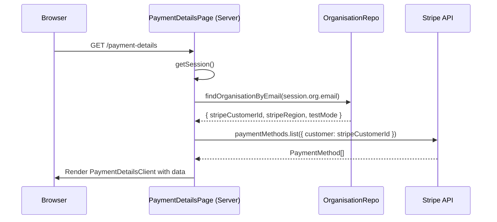
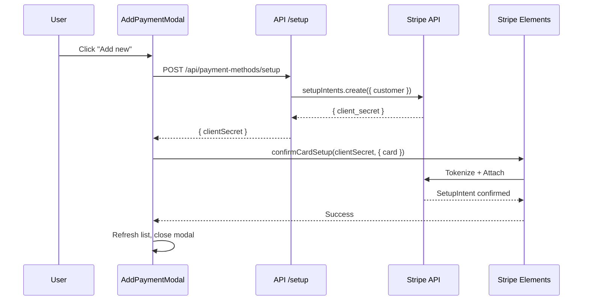
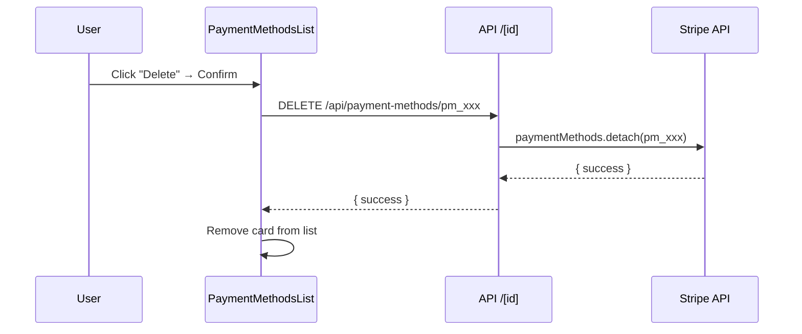

# Solution Design — BP-32 Add Payment Details Page
<!-- Template v4.0 | Inline Bilingual Format with Visual Flags -->

---

## TL;DR

| Aspect | Value |
|--------|-------|
| Feature | Add Payment Details Page |
| Status | Approved |
| Affected Roots | apphub-vision |
| Complexity | Medium |
| Estimated Effort | 10-12 hours |

---

## 1. Solution Overview

🇻🇳 Giải pháp này triển khai trang Payment Details cho Billing app cho phép users xem và quản lý payment methods trên Stripe. Giải pháp tận dụng các UI components Storybook hiện có trong khi thêm tích hợp Stripe thực.

Kiến trúc sử dụng Next.js App Router với Server Component cho data fetching ban đầu và Client Component wrapper cho interactivity. Stripe Elements được dùng để nhập card an toàn, đảm bảo card data không bao giờ chạm vào server của chúng ta.

🇬🇧 This solution implements a Payment Details page for the Billing app that allows users to view and manage their Stripe payment methods. The solution leverages existing Storybook UI components while adding real Stripe integration.

The architecture uses Next.js App Router with a Server Component for initial data fetching and a Client Component wrapper for interactivity. Stripe Elements is used for secure card input, ensuring card data never touches our server.

---

## 2. Architecture Overview

```
┌─────────────────────────────────────────────────────────────────────┐
│                         BILLING APP                                  │
│  ┌─────────────────────────────────────────────────────────────┐   │
│  │                    BillingLayout                              │   │
│  │  ┌──────────┬────────────────────────────────────────────┐   │   │
│  │  │ Sidebar  │              Content Area                   │   │   │
│  │  │          │  ┌─────────────────────────────────────┐   │   │   │
│  │  │ • Your   │  │  PaymentDetailsPage (Server Comp)    │   │   │   │
│  │  │   apps   │  │                                       │   │   │   │
│  │  │ • Billing│  │  ┌─────────────────────────────────┐ │   │   │   │
│  │  │   history│  │  │ PaymentDetailsClient            │ │   │   │   │
│  │  │ • Payment│  │  │ ┌─────────────────────────────┐ │ │   │   │   │
│  │  │   details│  │  │ │ PaymentMethodsList          │ │ │   │   │   │
│  │  │          │  │  │ └─────────────────────────────┘ │ │   │   │   │
│  │  │          │  │  │ ┌─────────────────────────────┐ │ │   │   │   │
│  │  │          │  │  │ │ BillingAddressCard          │ │ │   │   │   │
│  │  │          │  │  │ └─────────────────────────────┘ │ │   │   │   │
│  │  │          │  │  │ ┌─────────────────────────────┐ │ │   │   │   │
│  │  │          │  │  │ │ AddPaymentModal (Stripe)    │ │ │   │   │   │
│  │  │          │  │  │ └─────────────────────────────┘ │ │   │   │   │
│  │  │          │  │  └─────────────────────────────────┘ │   │   │   │
│  │  │          │  └─────────────────────────────────────┘   │   │   │
│  │  └──────────┴────────────────────────────────────────────┘   │   │
│  └─────────────────────────────────────────────────────────────┘   │
└─────────────────────────────────────────────────────────────────────┘
```

---

## 3. Key Design Decisions

### Decision 1: Server-side data fetching

🇻🇳 Trang fetch payment methods khi server render để hiển thị data ngay lập tức mà không có loading states. Điều này cải thiện UX và SEO.

🇬🇧 The page fetches payment methods during server render to show data immediately without loading states. This improves UX and SEO.

### Decision 2: Client-side Stripe Elements

🇻🇳 Card input được xử lý hoàn toàn bởi Stripe, duy trì PCI compliance mà không có card data nào trên servers của chúng ta. Đây là best practice cho xử lý payment.

🇬🇧 Card input is handled entirely by Stripe, maintaining PCI compliance without any card data on our servers. This is best practice for payment handling.

### Decision 3: SetupIntent flow

🇻🇳 Chúng ta dùng SetupIntent (không phải PaymentIntent) để thêm cards, đây là flow đúng để lưu cards cho sử dụng sau này mà không charge ngay.

🇬🇧 We use SetupIntent (not PaymentIntent) for adding cards, which is the correct flow for saving cards for future use without immediate charge.

### Decision 4: Organisation lookup via email

🇻🇳 Vì session đã chứa `org.email`, chúng ta query Organisation để lấy `stripeCustomerId`, tránh việc phải lưu customer ID trong session.

🇬🇧 Since session already contains `org.email`, we query Organisation to get `stripeCustomerId`, avoiding the need to store customer ID in session.

---

## 4. Data Flow Diagrams

### Page Load Flow



### Add Payment Method Flow



### Delete Payment Method Flow



---

## 5. File Structure

```
apps/billing/
├── app/
│   ├── layout.tsx                  # Root layout with BillingLayout
│   ├── payment-details/
│   │   └── page.tsx                # PaymentDetailsPage (Server Component)
│   │
│   ├── api/
│   │   └── payment-methods/
│   │       ├── route.ts            # GET list
│   │       ├── setup/
│   │       │   └── route.ts        # POST create SetupIntent
│   │       ├── default/
│   │       │   └── route.ts        # POST set default
│   │       └── [id]/
│   │           └── route.ts        # DELETE detach
│   │
│   └── components/
│       └── payment-details/
│           ├── PaymentDetailsClient.tsx  # Client wrapper with providers
│           ├── PaymentMethodsList.tsx    # List cards component
│           ├── PaymentMethodCard.tsx     # Single card row
│           ├── AddPaymentModal.tsx       # Stripe Elements modal
│           ├── BillingAddressCard.tsx    # Address display
│           └── EmptyState.tsx            # No cards state
│
├── lib/
│   └── repository/
│       └── stripe/
│           └── payment-method.repository.ts  # Stripe PM operations
```

---

## 6. Component Specifications

### PaymentDetailsPage (Server Component)

🇻🇳 Server component chịu trách nhiệm:
1. Lấy session và kiểm tra authentication
2. Query Organisation để lấy stripeCustomerId
3. Fetch payment methods từ Stripe
4. Truyền data xuống PaymentDetailsClient

🇬🇧 Server component responsible for:
1. Getting session and checking authentication
2. Querying Organisation to get stripeCustomerId
3. Fetching payment methods from Stripe
4. Passing data down to PaymentDetailsClient

```typescript
export default async function PaymentDetailsPage() {
  const session = await getSession();
  if (!session?.org?.email) {
    redirect('/');
  }

  const { data: org } = await organisationRepository.findOrganisationByEmail(
    session.org.email
  );

  const stripeClient = getStripeClient(org.stripeRegion, org.testMode);
  const paymentMethods = await stripeClient.paymentMethods.list({
    customer: org.stripeCustomerId,
    type: 'card'
  });

  return (
    <PaymentDetailsClient
      customerId={org.stripeCustomerId}
      stripeRegion={org.stripeRegion}
      testMode={org.testMode}
      initialPaymentMethods={paymentMethods}
      billingAddress={{
        email: session.org.email,
        name: session.org.name,
        phone: session.org.phone,
        domain: session.org.domain
      }}
    />
  );
}
```

### PaymentDetailsClient (Client Component)

🇻🇳 Client component wrapper quản lý state và provides Stripe context cho các child components.

🇬🇧 Client component wrapper that manages state and provides Stripe context for child components.

```typescript
'use client';

export function PaymentDetailsClient({
  customerId,
  stripeRegion,
  testMode,
  initialPaymentMethods,
  billingAddress
}: Props) {
  const stripePromise = loadStripe(getPublishableKey(stripeRegion, testMode));
  const [paymentMethods, setPaymentMethods] = useState(initialPaymentMethods);
  const [isAddModalOpen, setIsAddModalOpen] = useState(false);

  return (
    <Elements stripe={stripePromise}>
      <Layout>
        <HeaderBlock title="Payment details" />
        <PaymentMethodsList
          paymentMethods={paymentMethods}
          onAddNew={() => setIsAddModalOpen(true)}
        />
        <BillingAddressCard address={billingAddress} />
        <AddPaymentModal
          isOpen={isAddModalOpen}
          onClose={() => setIsAddModalOpen(false)}
          customerId={customerId}
        />
      </Layout>
    </Elements>
  );
}
```

### AddPaymentModal (Stripe Elements)

🇻🇳 Modal component sử dụng Stripe Elements để nhập card an toàn. Implements SetupIntent flow để attach card vào customer.

🇬🇧 Modal component using Stripe Elements for secure card input. Implements SetupIntent flow to attach card to customer.

```typescript
'use client';

export function AddPaymentModal({ isOpen, onClose, customerId, onSuccess }: Props) {
  const stripe = useStripe();
  const elements = useElements();

  async function handleSubmit() {
    // 1. Create SetupIntent
    const { data: setupData } = await tryCatch(
      fetch('/api/payment-methods/setup', { method: 'POST' }).then(r => r.json())
    );

    // 2. Confirm card setup with Stripe
    const { setupIntent, error } = await stripe.confirmCardSetup(
      setupData.clientSecret,
      { payment_method: { card: elements.getElement(CardElement)! } }
    );

    if (error) {
      setError(error.message);
      return;
    }

    // 3. Success
    onSuccess(setupIntent.payment_method);
    onClose();
  }

  return (
    <Modal open={isOpen} onClose={onClose}>
      <Modal.Title>Add payment method</Modal.Title>
      <Modal.Body>
        <CardElement />
      </Modal.Body>
      <Modal.Footer>
        <Button variant="outline" onClick={onClose}>Cancel</Button>
        <Button onClick={handleSubmit}>Add</Button>
      </Modal.Footer>
    </Modal>
  );
}
```

---

## 7. API Specifications

### GET /api/payment-methods

```typescript
// Response (200)
{
  paymentMethods: Array<{
    id: string;              // "pm_xxx"
    brand: string;           // "visa" | "mastercard" | "amex"
    last4: string;           // "4242"
    expMonth: number;        // 12
    expYear: number;         // 2028
    isDefault: boolean;
  }>;
  customerId: string;
  stripeRegion: string;
  testMode: boolean;
}
```

### POST /api/payment-methods/setup

```typescript
// Response (200)
{ clientSecret: string }  // "seti_xxx_secret_xxx"
```

### POST /api/payment-methods/default

```typescript
// Request
{ paymentMethodId: string }  // "pm_xxx"

// Response (200)
{ success: true }
```

### DELETE /api/payment-methods/[id]

```typescript
// Response (200)
{ success: true }
```

---

## 8. Security Considerations

| Aspect | Implementation |
|--------|---------------|
| Authentication | All API routes check session via `getSession()` |
| Authorization | Verify customerId matches session's org |
| Card Data | Never touches server - handled by Stripe Elements |
| HTTPS | All Stripe communication over TLS |
| API Keys | Server-side only, never exposed to client |

🇻🇳 Card data không bao giờ chạm vào server của chúng ta. Stripe Elements xử lý tất cả card input và tokenization trực tiếp với servers của Stripe. Điều này duy trì PCI compliance mà không cần các biện pháp bảo mật bổ sung.

🇬🇧 Card data never touches our server. Stripe Elements handles all card input and tokenization directly with Stripe's servers. This maintains PCI compliance without any additional security measures needed.

---

## 9. Dependencies

### New Packages

```json
{
  "@stripe/stripe-js": "^2.x",
  "@stripe/react-stripe-js": "^2.x"
}
```

### Existing (reuse)

| Package | Purpose |
|---------|---------|
| `@clearer/utils` | tryCatch utility |
| `@clearer/billing-database` | Prisma client |
| `StripeClient` | existing stripe-client.ts |

---

## 10. UI Components Mapping

| Storybook Component | Billing App Component |
|--------------------|-----------------------|
| PaymentDetails.stories.tsx | PaymentDetailsClient.tsx |
| PaymentMethods.stories.tsx | PaymentMethodsList.tsx |
| PaymentMethodAddNewModal.stories.tsx | AddPaymentModal.tsx (+ Stripe) |
| BillingAddress.stories.tsx | BillingAddressCard.tsx |

### Migration Approach

🇻🇳
1. Copy cấu trúc UI từ Storybook components
2. Thay mock data bằng Stripe data thật
3. Thay mock handlers bằng API calls thật
4. Thêm Stripe Elements cho card input

🇬🇧
1. Copy UI structure from Storybook components
2. Replace mock data with real Stripe data
3. Replace mock handlers with real API calls
4. Add Stripe Elements for card input

---

## 11. Environment Variables

```env
# Client-side (publishable keys)
NEXT_PUBLIC_STRIPE_UK_TEST_PUBLISHABLE_KEY=pk_test_xxx
NEXT_PUBLIC_STRIPE_UK_LIVE_PUBLISHABLE_KEY=pk_live_xxx

# Server-side (existing)
STRIPE_UK_TEST_SECRET_KEY=sk_test_xxx
STRIPE_UK_LIVE_SECRET_KEY=sk_live_xxx
```

---

## 12. Risks & Mitigations

| Risk | Likelihood | Impact | Mitigation |
|------|------------|--------|------------|
| Organisation not found | Low | High | Show error state, log for debugging |
| Stripe API errors | Medium | Medium | Use tryCatch, show user-friendly messages |
| No stripeCustomerId | Low | High | Handle gracefully, show setup message |
| Card declined | Medium | Low | Stripe Elements handles, show error |

---

## 13. Out of Scope

🇻🇳
- Edit billing address (modal exists nhưng không có save API)
- Multiple card types (PayPal, bank accounts)
- Multiple Stripe regions switching
- Invoice history display
- Payment retry logic

🇬🇧
- Edit billing address (modal exists but no save API)
- Multiple card types (PayPal, bank accounts)
- Multiple Stripe regions switching
- Invoice history display
- Payment retry logic
