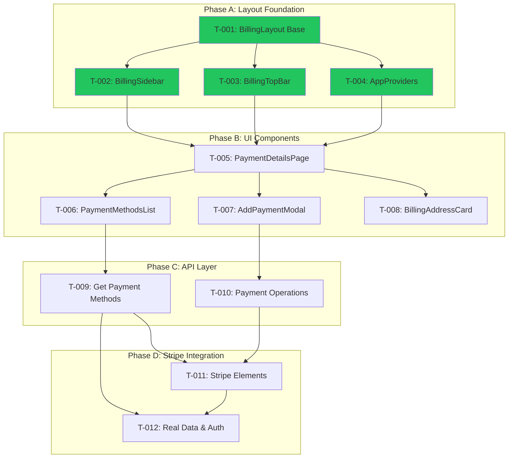

# Task Plan — BP-32 Add Payment Details Page
<!-- Template v4.0 | Inline Bilingual Format with Visual Flags -->

---

## TL;DR

| Aspect | Value |
|--------|-------|
| Feature | Add Payment Details Page |
| Total Tasks | 15 |
| Completed | 13 |
| In Progress | 0 |
| Pending | 2 |
| Estimated Total | ~3.5 days |

---

## Task Overview

| ID | Title | Status | Est | Phase |
|----|-------|--------|-----|-------|
| T-001 | Setup BillingLayout Base | ✅ Done | 2h | A |
| T-002 | Add BillingSidebar | ✅ Done | 1h | A |
| T-003 | Add BillingTopBar | ✅ Done | 1h | A |
| T-004 | Create AppProviders | ✅ Done | 30m | A |
| T-005 | Create PaymentDetailsPage Route | ⏸️ Pending | 1h | B |
| T-006 | Migrate PaymentMethodsList | ⏸️ Pending | 2h | B |
| T-007 | Migrate AddPaymentModal | ⏸️ Pending | 2h | B |
| T-008 | Migrate BillingAddressCard | ⏸️ Pending | 1h | B |
| T-009 | API - Get Payment Methods | ⏸️ Pending | 2h | C |
| T-010 | API - Payment Operations | ⏸️ Pending | 2h | C |
| T-011 | Stripe Elements Integration | ⏸️ Pending | 3h | D |
| T-012 | Connect Real Data & Auth | ⏸️ Pending | 3h | D |
| T-013 | Document Stripe Environment Setup | ⏸️ Pending | 30m | D |
| T-014 | Add/Edit Billing Address Modal & API | ⏸️ Pending | 4h | E |
| T-015 | TopBar Display Org Name & Email | ⏸️ Pending | 1h | E |

---

## Execution Flow



---

## Task Details

---

### T-001: Setup BillingLayout Base

| Aspect | Detail |
|--------|--------|
| Status | ✅ Done |
| Estimate | 2h |
| Phase | A - Layout Foundation |
| FR Coverage | FR-001 |

#### Description

🇻🇳 Tạo BillingLayout wrapper component với sidebar/main container structure. Layout sử dụng LayoutContent2ColScrollMain pattern với sidebar width 200px và main content area scrollable.

🇬🇧 Create BillingLayout wrapper component with sidebar/main container structure. Layout uses LayoutContent2ColScrollMain pattern with 200px sidebar width and scrollable main content area.

#### Implementation Notes

🇻🇳 
- Copy structure từ dashboard layout
- Dùng CSS Grid với `grid-template-columns: 200px 1fr`
- Main area cần `overflow-y: auto` cho scrolling
- Export từ `components/billing/layout/index.ts`

🇬🇧
- Copy structure from dashboard layout
- Use CSS Grid with `grid-template-columns: 200px 1fr`
- Main area needs `overflow-y: auto` for scrolling
- Export from `components/billing/layout/index.ts`

#### Files Changed

```
apps/billing/app/components/billing/layout/
├── billing-layout.tsx     # Main wrapper
├── layout-content.tsx     # Grid container
└── index.ts               # Exports
```

---

### T-002: Add BillingSidebar

| Aspect | Detail |
|--------|--------|
| Status | ✅ Done |
| Estimate | 1h |
| Phase | A - Layout Foundation |
| FR Coverage | FR-001 |

#### Description

🇻🇳 Tạo BillingSidebar với menu 3 items: Your apps, Billing history, Payment details. Dùng NavMain pattern với collapsible groups và icon cho mỗi menu item.

🇬🇧 Create BillingSidebar with 3-item menu: Your apps, Billing history, Payment details. Use NavMain pattern with collapsible groups and icons for each menu item.

#### Implementation Notes

🇻🇳
- Dùng SidebarProvider từ ui-utils
- Menu items với icons: LayoutGrid, Receipt, CreditCard
- Active state dựa trên pathname
- `/payment-details` cho Payment details route

🇬🇧
- Use SidebarProvider from ui-utils
- Menu items with icons: LayoutGrid, Receipt, CreditCard
- Active state based on pathname
- `/payment-details` for Payment details route

#### Files Changed

```
apps/billing/app/components/billing/layout/
├── sidebar/
│   ├── billing-sidebar.tsx   # Sidebar wrapper
│   ├── sidebar-nav.tsx       # Navigation component
│   ├── nav-main.tsx          # Menu items
│   └── index.ts
```

---

### T-003: Add BillingTopBar

| Aspect | Detail |
|--------|--------|
| Status | ✅ Done |
| Estimate | 1h |
| Phase | A - Layout Foundation |
| FR Coverage | FR-001 |

#### Description

🇻🇳 Tạo BillingTopBar với breadcrumb và user avatar dropdown. Breadcrumb hiển thị "Billing" > current page. Avatar menu có Sign out option.

🇬🇧 Create BillingTopBar with breadcrumb and user avatar dropdown. Breadcrumb shows "Billing" > current page. Avatar menu has Sign out option.

#### Implementation Notes

🇻🇳
- Dùng SidebarTrigger cho mobile toggle
- Breadcrumb từ @clearer/ui-utils
- User avatar và dropdown với session data
- Sign out gọi signOut() từ next-auth

🇬🇧
- Use SidebarTrigger for mobile toggle
- Breadcrumb from @clearer/ui-utils
- User avatar and dropdown with session data
- Sign out calls signOut() from next-auth

#### Files Changed

```
apps/billing/app/components/billing/layout/
├── topbar/
│   ├── billing-topbar.tsx    # TopBar wrapper
│   ├── nav-user.tsx          # User avatar dropdown
│   └── index.ts
```

---

### T-004: Create AppProviders

| Aspect | Detail |
|--------|--------|
| Status | ✅ Done |
| Estimate | 30m |
| Phase | A - Layout Foundation |
| FR Coverage | FR-001 |

#### Description

🇻🇳 Tạo AppProviders component để wrap SidebarProvider và TooltipProvider. Providers cần thiết cho sidebar và tooltip functionality trong UI components.

🇬🇧 Create AppProviders component to wrap SidebarProvider and TooltipProvider. Providers needed for sidebar and tooltip functionality in UI components.

#### Implementation Notes

🇻🇳
- Wrap children với SidebarProvider
- Thêm TooltipProvider cho tooltip components
- Export từ `components/providers/`

🇬🇧
- Wrap children with SidebarProvider
- Add TooltipProvider for tooltip components
- Export from `components/providers/`

#### Files Changed

```
apps/billing/app/components/providers/
├── app-providers.tsx
└── index.ts
```

---

### T-005: Create PaymentDetailsPage Route

| Aspect | Detail |
|--------|--------|
| Status | ⏸️ Pending |
| Estimate | 1h |
| Phase | B - UI Components |
| FR Coverage | FR-002 |
| Blocked By | None |

#### Description

🇻🇳 Tạo route `/payment-details` với page component. Page dùng BillingLayout, có HeaderBlock với title, và placeholder sections cho PaymentMethods và BillingAddress.

🇬🇧 Create route `/payment-details` with page component. Page uses BillingLayout, has HeaderBlock with title, and placeholder sections for PaymentMethods and BillingAddress.

#### Implementation Notes

🇻🇳
- Tạo folder `app/payment-details/page.tsx`
- Dùng BillingLayout làm wrapper
- HeaderBlock với title="Payment details"
- Two Card components cho 2 sections
- Mock data initially

🇬🇧
- Create folder `app/payment-details/page.tsx`
- Use BillingLayout as wrapper
- HeaderBlock with title="Payment details"
- Two Card components for 2 sections
- Mock data initially

#### Files To Create

```
apps/billing/app/payment-details/
├── page.tsx              # Server component
└── payment-details.tsx   # Client component
```

---

### T-006: Migrate PaymentMethodsList

| Aspect | Detail |
|--------|--------|
| Status | ⏸️ Pending |
| Estimate | 2h |
| Phase | B - UI Components |
| FR Coverage | FR-003 |
| Blocked By | T-005 |

#### Description

🇻🇳 Migrate PaymentMethodsList từ Storybook. Component hiển thị list of cards với brand icon, masked number, default badge, và dropdown menu cho actions.

🇬🇧 Migrate PaymentMethodsList from Storybook. Component displays list of cards with brand icon, masked number, default badge, and dropdown menu for actions.

#### Implementation Notes

🇻🇳
- Copy component structure từ Storybook
- Adapt imports cho billing app
- PaymentMethodCard cho mỗi card
- DropdownMenu với "Set as default", "Delete"
- AlertDialogConfirm cho confirm actions
- Empty state component

🇬🇧
- Copy component structure from Storybook
- Adapt imports for billing app
- PaymentMethodCard for each card
- DropdownMenu with "Set as default", "Delete"
- AlertDialogConfirm for confirm actions
- Empty state component

#### Files To Create

```
apps/billing/app/components/payment/
├── payment-methods-list.tsx
├── payment-method-card.tsx
├── card-brand-icon.tsx
└── index.ts
```

---

### T-007: Migrate AddPaymentModal

| Aspect | Detail |
|--------|--------|
| Status | ⏸️ Pending |
| Estimate | 2h |
| Phase | B - UI Components |
| FR Coverage | FR-004 |
| Blocked By | T-005 |

#### Description

🇻🇳 Migrate AddPaymentModal từ Storybook với placeholder cho Stripe CardElement. Stripe integration sẽ được thêm trong T-011.

🇬🇧 Migrate AddPaymentModal from Storybook with placeholder for Stripe CardElement. Stripe integration will be added in T-011.

#### Implementation Notes

🇻🇳
- Copy modal từ Storybook
- Placeholder div cho CardElement
- "Use as default" checkbox với state
- Terms text với links (Privacy, Terms)
- Cancel/Add buttons
- Add button disabled cho đến khi Stripe integrated

🇬🇧
- Copy modal from Storybook
- Placeholder div for CardElement
- "Use as default" checkbox with state
- Terms text with links (Privacy, Terms)
- Cancel/Add buttons
- Add button disabled until Stripe integrated

#### Files To Create

```
apps/billing/app/components/payment/
├── add-payment-modal.tsx
└── stripe-card-placeholder.tsx  # Replaced in T-011
```

---

### T-008: Migrate BillingAddressCard

| Aspect | Detail |
|--------|--------|
| Status | ✅ Done |
| Estimate | 1h |
| Phase | B - UI Components |
| FR Coverage | FR-005 |
| Blocked By | T-005 |

#### Description

🇻🇳 Migrate BillingAddressCard từ Storybook. Hiển thị address info từ mock data. Edit button có mặt, functionality implement ở T-014.

🇬🇧 Migrate BillingAddressCard from Storybook. Display address info from mock data. Edit button present, functionality implemented in T-014.

#### Implementation Notes#### Implementation Notes

🇻🇳
- Copy component từ Storybook
- Show: name, email, phone, domain
- Edit button present nhưng disabled/no-op
- Dùng mock data initially

🇬🇧
- Copy component from Storybook
- Show: name, email, phone, domain
- Edit button present but disabled/no-op
- Use mock data initially

#### Files To Create

```
apps/billing/app/components/payment/
├── billing-address-card.tsx
```

---

### T-009: API - Get Payment Methods

| Aspect | Detail |
|--------|--------|
| Status | ⏸️ Pending |
| Estimate | 2h |
| Phase | C - API Layer |
| FR Coverage | FR-006 |
| Blocked By | T-006 |

#### Description

🇻🇳 Tạo API endpoint GET `/api/payment-methods` để fetch payment methods từ Stripe. Flow: validate session → get organisation → list Stripe payment methods.

🇬🇧 Create API endpoint GET `/api/payment-methods` to fetch payment methods from Stripe. Flow: validate session → get organisation → list Stripe payment methods.

#### Implementation Notes

🇻🇳
- Route handler trong `app/api/payment-methods/route.ts`
- Dùng auth() để get session
- Query Organisation by session.org.email
- Gọi stripe.customers.listPaymentMethods()
- Format response với PaymentMethod interface
- tryCatch cho all async calls

🇬🇧
- Route handler in `app/api/payment-methods/route.ts`
- Use auth() to get session
- Query Organisation by session.org.email
- Call stripe.customers.listPaymentMethods()
- Format response with PaymentMethod interface
- tryCatch for all async calls

#### Files To Create

```
apps/billing/app/api/payment-methods/
├── route.ts              # GET handler
└── utils.ts              # Shared utilities
```

---

### T-010: API - Payment Operations

| Aspect | Detail |
|--------|--------|
| Status | ⏸️ Pending |
| Estimate | 2h |
| Phase | C - API Layer |
| FR Coverage | FR-007 |
| Blocked By | T-009 |

#### Description

🇻🇳 Tạo API endpoints cho SetupIntent creation, set default, và delete payment methods.

🇬🇧 Create API endpoints for SetupIntent creation, set default, and delete payment methods.

#### Implementation Notes

🇻🇳
- POST `/api/payment-methods/setup` - tạo SetupIntent
- POST `/api/payment-methods/default` - set default payment method
- DELETE `/api/payment-methods/[id]` - detach payment method
- All endpoints validate session
- tryCatch cho error handling

🇬🇧
- POST `/api/payment-methods/setup` - create SetupIntent
- POST `/api/payment-methods/default` - set default payment method
- DELETE `/api/payment-methods/[id]` - detach payment method
- All endpoints validate session
- tryCatch for error handling

#### Files To Create

```
apps/billing/app/api/payment-methods/
├── setup/route.ts        # POST - create SetupIntent
├── default/route.ts      # POST - set default
└── [id]/route.ts         # DELETE - detach
```

---

### T-011: Stripe Elements Integration

| Aspect | Detail |
|--------|--------|
| Status | ⏸️ Pending |
| Estimate | 3h |
| Phase | D - Stripe Integration |
| FR Coverage | FR-008 |
| Blocked By | T-007, T-010 |

#### Description

🇻🇳 Thay placeholder trong AddPaymentModal bằng Stripe Elements CardElement. Implement SetupIntent flow để thêm cards.

🇬🇧 Replace placeholder in AddPaymentModal with Stripe Elements CardElement. Implement SetupIntent flow to add cards.

#### Implementation Notes

🇻🇳
- Install: `@stripe/stripe-js`, `@stripe/react-stripe-js`
- Tạo StripeProvider wrapper component
- Load Stripe với publishable key
- CardElement trong modal
- On submit: POST /setup → confirmCardSetup() → refresh list
- Error display từ Stripe
- Loading state during submit

🇬🇧
- Install: `@stripe/stripe-js`, `@stripe/react-stripe-js`
- Create StripeProvider wrapper component
- Load Stripe with publishable key
- CardElement in modal
- On submit: POST /setup → confirmCardSetup() → refresh list
- Error display from Stripe
- Loading state during submit

#### Files To Create/Modify

```
apps/billing/app/components/providers/
├── stripe-provider.tsx   # New

apps/billing/app/components/payment/
├── add-payment-modal.tsx # Modify - add CardElement
├── stripe-card-element.tsx # New
```

---

### T-012: Connect Real Data & Auth

| Aspect | Detail |
|--------|--------|
| Status | ⏸️ Pending |
| Estimate | 3h |
| Phase | D - Stripe Integration |
| FR Coverage | FR-009, FR-010, FR-011 |
| Blocked By | T-009, T-011 |

#### Description

🇻🇳 Connect tất cả components với real data từ APIs và session. Implement authentication check và error states.

🇬🇧 Connect all components to real data from APIs and session. Implement authentication check and error states.

#### Implementation Notes

🇻🇳
- PaymentMethodsList fetch từ GET /api/payment-methods
- Set Default gọi POST /api/payment-methods/default
- Delete gọi DELETE /api/payment-methods/[id]
- BillingAddressCard dùng session.org data
- Auth check ở page level
- Error states cho: no session, no org, no customer

🇬🇧
- PaymentMethodsList fetches from GET /api/payment-methods
- Set Default calls POST /api/payment-methods/default
- Delete calls DELETE /api/payment-methods/[id]
- BillingAddressCard uses session.org data
- Auth check at page level
- Error states for: no session, no org, no customer

#### Files To Modify

```
apps/billing/app/payment-details/
├── page.tsx              # Add auth check
├── payment-details.tsx   # Connect real data

apps/billing/app/components/payment/
├── payment-methods-list.tsx  # Add API calls
├── billing-address-card.tsx  # Use session data
```

---

### T-013: Document Stripe Environment Setup

| Aspect | Detail |
|--------|--------|
| Status | ⏸️ Pending |
| Estimate | 30m |
| Phase | D - Stripe Integration |
| FR Coverage | Documentation |
| Blocked By | T-010 |

#### Description

🇻🇳 Cập nhật `.env.example` và `README.md` với hướng dẫn setup Stripe environment variables. Đảm bảo các dev khác và DevOps có thể setup project dễ dàng.

🇬🇧 Update `.env.example` and `README.md` with Stripe environment variables setup guide. Ensure other developers and DevOps can easily set up the project.

#### Implementation Notes

🇻🇳
- Thêm `NEXT_PUBLIC_STRIPE_PUBLISHABLE_KEY` vào `.env.example`
- Cập nhật README với section "Stripe Setup"
- Giải thích cách lấy keys từ Stripe Dashboard
- Phân biệt Test vs Live keys
- Note về security (không commit secret keys)

🇬🇧
- Add `NEXT_PUBLIC_STRIPE_PUBLISHABLE_KEY` to `.env.example`
- Update README with "Stripe Setup" section
- Explain how to get keys from Stripe Dashboard
- Differentiate Test vs Live keys
- Note about security (never commit secret keys)

#### Files To Modify

```
apps/billing/
├── .env.example          # Add Stripe publishable key
└── README.md             # Add Stripe setup section
```

---

### T-014: Add/Edit Billing Address Modal & API

| Aspect | Detail |
|--------|--------|
| Status | ⏸️ Pending |
| Estimate | 4h |
| Phase | E - Extended Features |
| FR Coverage | FR-012 |
| Blocked By | T-008, T-012 |

#### Description

🇻🇳 Implement modal component cho add/edit billing address. Tạo POST API endpoint để lưu address vào Stripe Customer. Modal có form validation và error handling.

🇬🇧 Implement modal component for add/edit billing address. Create POST API endpoint to save address to Stripe Customer. Modal has form validation and error handling.

#### Implementation Notes

🇻🇳
- Tạo AddBillingAddressModal component
- Form fields: name, email, phone, address (line1, line2, city, state, postal, country)
- Reuse cho cả Add và Edit mode (prop: existingAddress)
- POST /api/billing-address endpoint update Stripe Customer
- Validate required fields
- Toast notification on success/error

🇬🇧
- Create AddBillingAddressModal component
- Form fields: name, email, phone, address (line1, line2, city, state, postal, country)
- Reuse for both Add and Edit mode (prop: existingAddress)
- POST /api/billing-address endpoint updates Stripe Customer
- Validate required fields
- Toast notification on success/error

#### Files To Create/Modify

```
apps/billing/app/components/payment/
├── AddBillingAddressModal.tsx    # New modal component
├── BillingAddressCard.tsx        # Connect Edit button to modal

apps/billing/app/api/billing-address/
└── route.ts                      # Add POST handler
```

---

### T-015: TopBar Display Org Name & Email

| Aspect | Detail |
|--------|--------|
| Status | ⏸️ Pending |
| Estimate | 1h |
| Phase | E - Extended Features |
| FR Coverage | FR-013 |
| Blocked By | T-003 |

#### Description

🇻🇳 Update BillingTopBar để hiển thị organisation name và email thay vì user info. Lấy data từ session.org, fallback to user info nếu org không available.

🇬🇧 Update BillingTopBar to display organisation name and email instead of user info. Get data from session.org, fallback to user info if org not available.

#### Implementation Notes

🇻🇳
- Update nav-user.tsx để nhận org data
- Display org.name thay vì user.name
- Display org.email thay vì user.email
- Fallback logic: session.org?.name || user.name
- Test với session có và không có org data

🇬🇧
- Update nav-user.tsx to receive org data
- Display org.name instead of user.name
- Display org.email instead of user.email
- Fallback logic: session.org?.name || user.name
- Test with session with and without org data

#### Files To Modify

```
apps/billing/app/components/layout/
├── billing-topbar.tsx    # Pass org data to nav-user
├── nav-user.tsx          # Display org name/email with fallback
```

---

## Requirements Coverage

| Requirement | Tasks | Coverage |
|-------------|-------|----------|
| FR-001 | T-001, T-002, T-003, T-004 | Full |
| FR-002 | T-005 | Full |
| FR-003 | T-006 | Full |
| FR-004 | T-007 | Full |
| FR-005 | T-008 | Full |
| FR-006 | T-009 | Full |
| FR-007 | T-010 | Full |
| FR-008 | T-011 | Full |
| FR-009 | T-012 | Full |
| FR-010 | T-012 | Full |
| FR-011 | T-012 | Full || FR-012 | T-014 | Full |
| FR-013 | T-015 | Full |
---

## Phase Summary

| Phase | Tasks | Status | Est |
|-------|-------|--------|-----|
| A - Layout Foundation | T-001 to T-004 | ✅ Done | 4.5h |
| B - UI Components | T-005 to T-008 | ⏸️ Pending | 6h |
| C - API Layer | T-009, T-010 | ⏸️ Pending | 4h |
| D - Stripe Integration | T-011, T-012, T-013 | ⏸️ Pending | 6.5h |
| E - Extended Features | T-014, T-015 | ⏸️ Pending | 5h |

---

## Approval

| Role | Status | Date |
|------|--------|------|
| Plan Author | ✅ Done | 2026-01-24 |
| Reviewer | ✅ Approved | 2026-01-24 |
