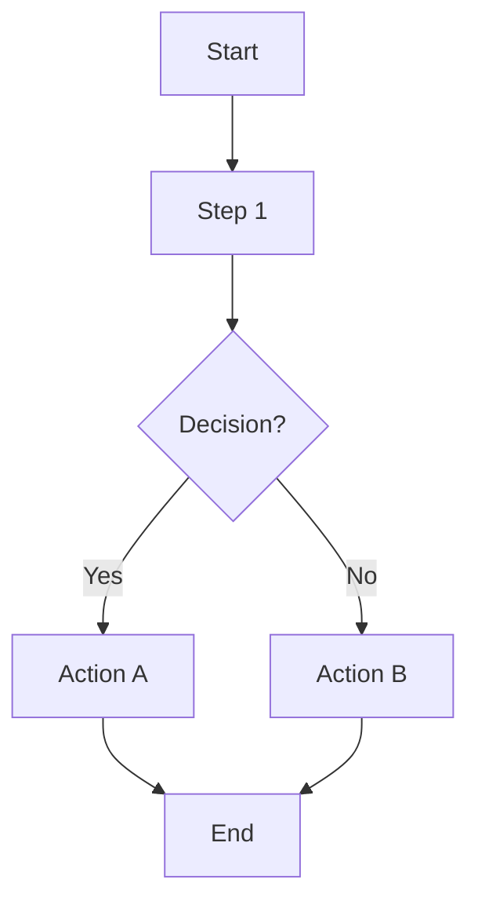
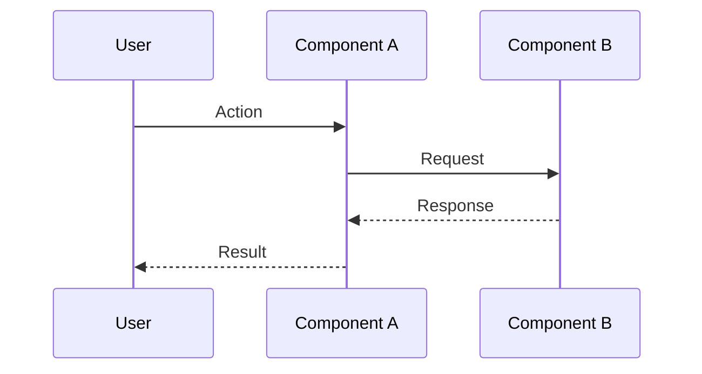

# Analysis & Solution Design
# Template v3.0 - Hybrid Bilingual Format (Shared Data + Language Zones)

---

## 📊 SHARED DATA
<!-- Technical data - no translation needed / Dữ liệu kỹ thuật - không cần dịch -->

### TL;DR

| Aspect | Value |
|--------|-------|
| Feature | `<name>` |
| Status | Draft / In Review / Approved |
| Affected Roots | `<root1>`, `<root2>` |
| Complexity | Low / Medium / High |
| Estimated Effort | `<time>` |

### Clarifying Questions

| # | Question | Answer | Status |
|---|----------|--------|--------|
| 1 | `<question>` | `<answer>` | Open / Resolved |
| 2 | `<question>` | `<answer>` | Open / Resolved |

### Existing Patterns Found

| Location | Pattern | Reusable |
|----------|---------|----------|
| `<file-path>` | `<pattern-name>` | Yes / No / Partial |

### Dependencies

| Package | Version | Installed |
|---------|---------|-----------|
| `<package>` | `<version>` | Yes / No |

### Approach Comparison Matrix

| Aspect | Option A | Option B | Option C |
|--------|----------|----------|----------|
| Description | ... | ... | ... |
| Effort | Low/Med/High | Low/Med/High | Low/Med/High |
| Risk | Low/Med/High | Low/Med/High | Low/Med/High |
| Maintainability | Low/Med/High | Low/Med/High | Low/Med/High |

**Chosen:** `Option X`

### Components

| Component | Root | Type |
|-----------|------|------|
| `<name>` | `<root>` | New / Modify / Delete |

### Data Flow

| Step | Action | From | To |
|------|--------|------|-----|
| 1 | ... | ... | ... |
| 2 | ... | ... | ... |

### Cross-Root Impact

| Root | Change Type | Sync Required |
|------|-------------|---------------|
| `<root1>` | Code / Config / Both | Yes / No |
| `<root2>` | Code / Config / Both | Yes / No |

### Integration Points

| From | To | Type | Contract |
|------|-----|------|----------|
| `<root1>` | `<root2>` | API / Package / Event | `<interface>` |

### Diagrams

#### Flow Overview

#### Sequence Diagram

### Decision Log

| ID | Date | Decision | Chosen Option |
|----|------|----------|---------------|
| D1 | YYYY-MM-DD | `<decision-title>` | Option X |
| D2 | YYYY-MM-DD | `<decision-title>` | Option Y |

### Risk Assessment

| Risk | Likelihood | Impact | Mitigation |
|------|------------|--------|------------|
| `<risk-1>` | Low/Med/High | Low/Med/High | `<mitigation>` |
| `<risk-2>` | Low/Med/High | Low/Med/High | `<mitigation>` |

### Approval Status

| Role | Name | Status | Date |
|------|------|--------|------|
| Author | ... | ✅ Done | ... |
| Reviewer | ... | ⏳ Pending | ... |

---

## 🇬🇧 ENGLISH

### 1. Problem Statement

#### Current Behavior
> Describe what the system currently does (or doesn't do)

#### Desired Behavior
> Describe what the system should do after this change

#### Gap Analysis
> Explain the gap between current and desired state

### 2. Assumptions

- Assumption 1: ...
- Assumption 2: ...

### 3. Constraints

- Constraint 1: ...
- Constraint 2: ...

### 4. Solution Overview

> 1-2 paragraph description of the chosen solution approach.
> Explain WHY this approach was chosen over alternatives.

### 5. Rationale for Chosen Approach

**Why Option X over Option Y?**

- Reason 1: ...
- Reason 2: ...
- Reason 3: ...

### 6. Similar Implementations & Learnings

| Location | What We Learned |
|----------|-----------------|
| `<file-path>` | ... |

### 7. Decision Details

#### Decision D1: `<title>`

**Context:** ...

**Options Considered:**
1. Option A: ...
2. Option B: ...
3. Option C: ...

**Decision:** Option X

**Rationale:** ...

**Consequences:** ...

### 8. Risk Details

#### Risk 1: `<title>`

**Description:** ...

**Mitigation Strategy:** ...

### 9. Notes & Concerns

- Note 1: ...
- Concern 1: ...

---

## 🇻🇳 TIẾNG VIỆT

### 1. Mô tả Vấn đề

#### Hành vi Hiện tại
> Mô tả hệ thống hiện đang làm gì (hoặc không làm gì)

#### Hành vi Mong muốn
> Mô tả hệ thống nên làm gì sau thay đổi này

#### Phân tích Khoảng cách
> Giải thích khoảng cách giữa trạng thái hiện tại và mong muốn

### 2. Giả định

- Giả định 1: ...
- Giả định 2: ...

### 3. Ràng buộc

- Ràng buộc 1: ...
- Ràng buộc 2: ...

### 4. Tổng quan Giải pháp

> Mô tả 1-2 đoạn về hướng tiếp cận giải pháp đã chọn.
> Giải thích TẠI SAO chọn hướng này thay vì các phương án khác.

### 5. Lý do Chọn Hướng tiếp cận

**Tại sao Option X thay vì Option Y?**

- Lý do 1: ...
- Lý do 2: ...
- Lý do 3: ...

### 6. Triển khai Tương tự & Bài học

| Vị trí | Bài học Rút ra |
|--------|----------------|
| `<file-path>` | ... |

### 7. Chi tiết Quyết định

#### Quyết định D1: `<tiêu đề>`

**Bối cảnh:** ...

**Các lựa chọn Đã cân nhắc:**
1. Option A: ...
2. Option B: ...
3. Option C: ...

**Quyết định:** Option X

**Lý do:** ...

**Hệ quả:** ...

### 8. Chi tiết Rủi ro

#### Rủi ro 1: `<tiêu đề>`

**Mô tả:** ...

**Chiến lược Giảm thiểu:** ...

### 9. Ghi chú & Quan ngại

- Ghi chú 1: ...
- Quan ngại 1: ...

---

## ⏭️ Next Step

> After approval, proceed to Phase 1 (Specification)
> Sau khi phê duyệt, tiến hành Phase 1 (Đặc tả)

Reply: `approved` or `revise: <feedback>`
