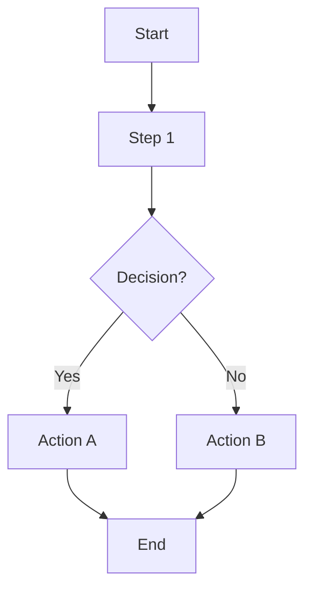
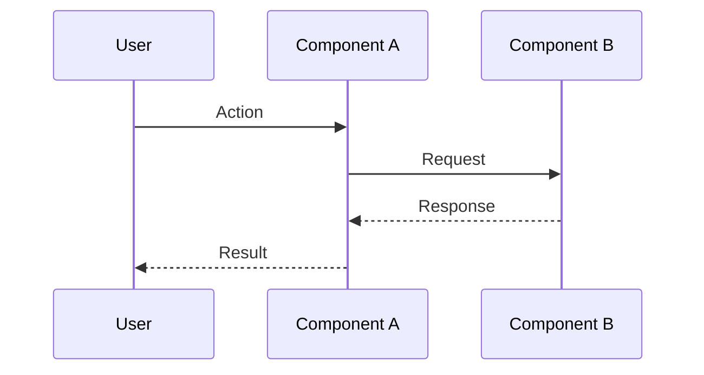

# Analysis & Solution Design / Phân tích & Thiết kế Giải pháp
# Template v2.0 - Bilingual inline format

---

## 📋 TL;DR

| Aspect / Khía cạnh | Detail / Chi tiết |
|-------------------|-------------------|
| Feature / Tính năng | `<name>` |
| Status / Trạng thái | Draft / Bản nháp |
| Affected Roots / Roots ảnh hưởng | `<root1>`, `<root2>` |
| Complexity / Độ phức tạp | Low / Medium / High |
| Estimated Effort / Ước lượng | `<time>` |

---

## 1. Request Analysis / Phân tích Yêu cầu

### 1.1 Problem Statement / Mô tả Vấn đề

**Current behavior / Hành vi hiện tại:**
- EN: ...
- VI: ...

**Desired behavior / Hành vi mong muốn:**
- EN: ...
- VI: ...

**Gap / Khoảng cách:**
- EN: ...
- VI: ...

### 1.2 Clarifying Questions / Câu hỏi Làm rõ

> ⚠️ Must be answered before proceeding / Cần trả lời trước khi tiếp tục

| # | Question / Câu hỏi | Answer / Trả lời |
|---|-------------------|------------------|
| 1 | EN: ... / VI: ... | |
| 2 | EN: ... / VI: ... | |

### 1.3 Assumptions / Giả định

- EN: ... / VI: ...
- EN: ... / VI: ...

### 1.4 Constraints / Ràng buộc

- EN: ... / VI: ...
- EN: ... / VI: ...

---

## 2. Solution Research / Nghiên cứu Giải pháp

### 2.1 Existing Patterns / Pattern Hiện có

| Location / Vị trí | Pattern | Applicable / Áp dụng được |
|-------------------|---------|---------------------------|
| `<file-path>` | ... | Yes / No / Partial |

### 2.2 Similar Implementations / Triển khai Tương tự

| Location / Vị trí | Description / Mô tả | Learnings / Bài học |
|-------------------|---------------------|---------------------|
| `<file-path>` | EN: ... / VI: ... | EN: ... / VI: ... |

### 2.3 Dependencies / Phụ thuộc

| Package | Purpose / Mục đích | Installed / Đã cài |
|---------|--------------------|--------------------|
| ... | EN: ... / VI: ... | Yes / No |

---

## 3. Solution Design / Thiết kế Giải pháp

### 3.1 Overview / Tổng quan

**EN:**
> 1-2 paragraph description of the solution approach

**VI:**
> Mô tả 1-2 đoạn về hướng tiếp cận giải pháp

### 3.2 Approach Comparison / So sánh Các Hướng tiếp cận

| Aspect | Option A | Option B | Option C |
|--------|----------|----------|----------|
| Description / Mô tả | ... | ... | ... |
| Pros / Ưu điểm | ... | ... | ... |
| Cons / Nhược điểm | ... | ... | ... |
| Effort / Công sức | Low/Med/High | Low/Med/High | Low/Med/High |

**Chosen / Đã chọn:** `Option X`

**Rationale / Lý do:**
- EN: ...
- VI: ...

### 3.3 Components / Thành phần

| Component | Root | Purpose / Mục đích |
|-----------|------|-------------------|
| `<name>` | `<root>` | EN: ... / VI: ... |

### 3.4 Data Flow / Luồng Dữ liệu

| Step | Action / Hành động | From / Từ | To / Đến |
|------|-------------------|-----------|----------|
| 1 | ... | ... | ... |
| 2 | ... | ... | ... |

---

## 4. Cross-Root Impact / Ảnh hưởng Đa Root

### 4.1 Affected Roots Summary / Tóm tắt Roots Ảnh hưởng

| Root | Changes / Thay đổi | Sync Required / Cần đồng bộ |
|------|-------------------|----------------------------|
| `<root1>` | EN: ... / VI: ... | Yes / No |
| `<root2>` | EN: ... / VI: ... | Yes / No |

### 4.2 Integration Points / Điểm Tích hợp

| From / Từ | To / Đến | Type / Loại | Contract / Hợp đồng |
|-----------|----------|-------------|---------------------|
| `<root1>` | `<root2>` | API / Package / Event | ... |

---

## 5. Diagrams / Sơ đồ

### 5.1 Flow Overview / Tổng quan Luồng xử lý

**Legend / Chú thích:**
- EN: ...
- VI: ...

### 5.2 Sequence Diagram / Sơ đồ Tuần tự

---

## 6. Decision Log / Nhật ký Quyết định

### Decision 1: `<Title>`

| Aspect | Detail |
|--------|--------|
| Date / Ngày | YYYY-MM-DD |
| Context / Bối cảnh | EN: ... / VI: ... |
| Options / Lựa chọn | 1) ... 2) ... 3) ... |
| Decision / Quyết định | Option X |
| Rationale / Lý do | EN: ... / VI: ... |
| Consequences / Hệ quả | EN: ... / VI: ... |

---

## 7. Risk Assessment / Đánh giá Rủi ro

| Risk / Rủi ro | Likelihood / Khả năng | Impact / Tác động | Mitigation / Giảm thiểu |
|---------------|----------------------|-------------------|------------------------|
| EN: ... / VI: ... | Low/Med/High | Low/Med/High | EN: ... / VI: ... |

---

## 8. Approval / Phê duyệt

| Role / Vai trò | Name / Tên | Status / Trạng thái | Date / Ngày |
|----------------|------------|---------------------|-------------|
| Author / Tác giả | ... | ✅ Done | ... |
| Reviewer | ... | ⏳ Pending | ... |

---

## Next Step / Bước tiếp theo

> After approval, proceed to Phase 1 (Specification)
> Sau khi phê duyệt, tiến hành Phase 1 (Đặc tả)

Reply / Trả lời: `approved` or `revise: <feedback>`
