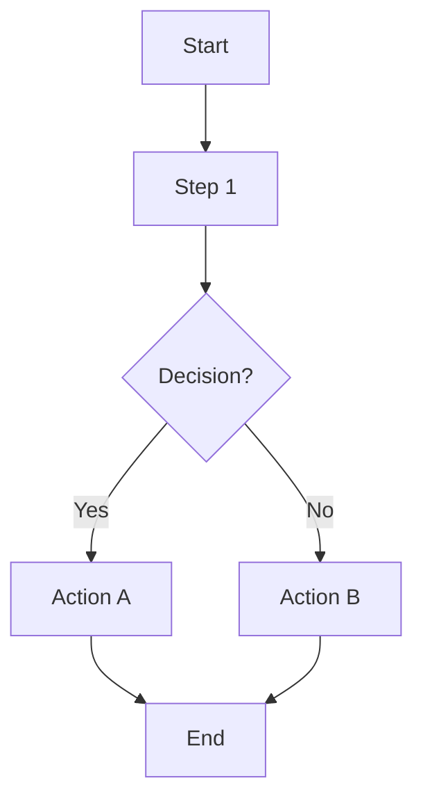
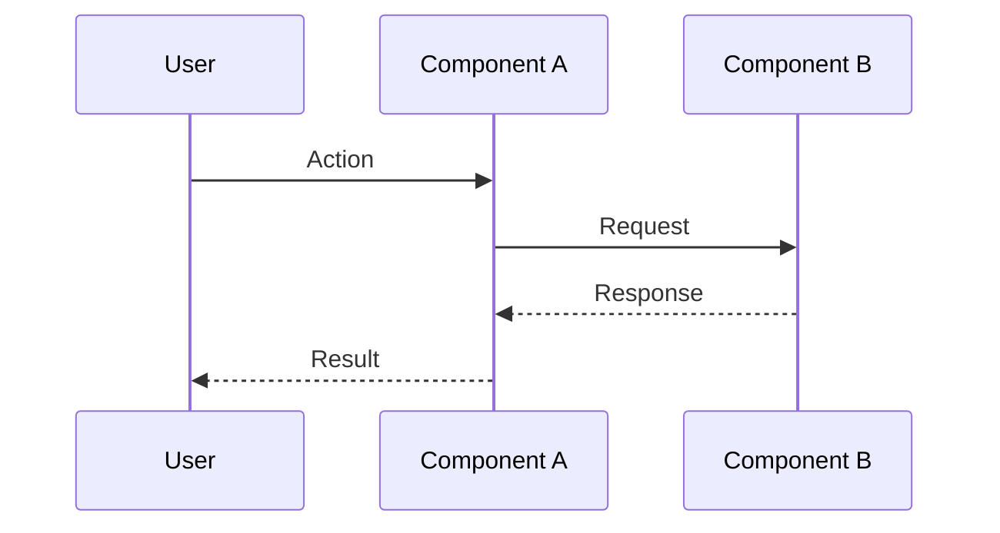

# Analysis & Solution Design — `<Feature Name>`
<!-- Template Version: 1.0 | Contract: v1.0 | Last Updated: 2026-02-01 -->
<!-- 🇻🇳 Vietnamese first, 🇬🇧 English follows — for easy scanning -->

---

## TL;DR

| Aspect | Value |
|--------|-------|
| Feature | `<name>` |
| Status | Draft / In Review / Approved |
| Affected Roots | `<root1>`, `<root2>` |
| Complexity | Low / Medium / High |
| Estimated Effort | `<time>` |

---

## 1. Problem Statement

### Current Behavior

🇻🇳 Mô tả hệ thống hiện đang làm gì (hoặc không làm gì).

🇬🇧 Describe what the system currently does (or doesn't do).

### Desired Behavior

🇻🇳 Mô tả hệ thống nên làm gì sau thay đổi này.

🇬🇧 Describe what the system should do after this change.

### Gap Analysis

🇻🇳 Giải thích khoảng cách giữa trạng thái hiện tại và mong muốn.

🇬🇧 Explain the gap between current and desired state.

---

## 2. Clarifying Questions

| # | Question | Answer | Status |
|---|----------|--------|--------|
| 1 | `<question>` | `<answer>` | Open / Resolved |
| 2 | `<question>` | `<answer>` | Open / Resolved |

---

## 3. Assumptions & Constraints

### Assumptions

🇻🇳
- Giả định 1: ...
- Giả định 2: ...

🇬🇧
- Assumption 1: ...
- Assumption 2: ...

### Constraints

🇻🇳
- Ràng buộc 1: ...
- Ràng buộc 2: ...

🇬🇧
- Constraint 1: ...
- Constraint 2: ...

---

## 4. Existing Patterns Found

| Location | Pattern | Reusable |
|----------|---------|----------|
| `<file-path>` | `<pattern-name>` | Yes / No / Partial |

---

## 5. Solution Options

### Option A: `<Name>`

🇻🇳 Mô tả hướng tiếp cận A, ưu nhược điểm.

🇬🇧 Describe approach A, pros and cons.

### Option B: `<Name>`

🇻🇳 Mô tả hướng tiếp cận B, ưu nhược điểm.

🇬🇧 Describe approach B, pros and cons.

### Comparison Matrix

| Aspect | Option A | Option B |
|--------|----------|----------|
| Description | ... | ... |
| Effort | Low/Med/High | Low/Med/High |
| Risk | Low/Med/High | Low/Med/High |
| Maintainability | Low/Med/High | Low/Med/High |

### Chosen Solution

**Decision:** `Option X`

🇻🇳 Giải thích tại sao chọn option này thay vì các option khác.

🇬🇧 Explain why this option was chosen over alternatives.

---

## 6. Solution Overview

🇻🇳 Mô tả 1-2 đoạn về hướng tiếp cận giải pháp đã chọn. Bao gồm high-level architecture và các component chính.

🇬🇧 1-2 paragraph description of the chosen solution approach. Include high-level architecture and main components.

### Architecture Diagram

---

## 7. Components

| Component | Root | Type | Description |
|-----------|------|------|-------------|
| `<name>` | `<root>` | New / Modify | `<brief>` |

### Component Details

#### `<Component 1>`

🇻🇳 Mô tả chi tiết component này làm gì, cách hoạt động, và interface.

🇬🇧 Detailed description of what this component does, how it works, and its interface.

#### `<Component 2>`

🇻🇳 Mô tả chi tiết component này.

🇬🇧 Detailed description of this component.

---

## 8. Data Flow

| Step | Action | From | To |
|------|--------|------|-----|
| 1 | ... | ... | ... |
| 2 | ... | ... | ... |

### Sequence Diagram

---

## 9. Cross-Root Impact

| Root | Change Type | Sync Required |
|------|-------------|---------------|
| `<root1>` | Code / Config / Both | Yes / No |
| `<root2>` | Code / Config / Both | Yes / No |

### Integration Points

| From | To | Type | Contract |
|------|-----|------|----------|
| `<root1>` | `<root2>` | API / Package / Event | `<interface>` |

🇻🇳 Giải thích cách các roots tương tác với nhau và những lưu ý khi đồng bộ.

🇬🇧 Explain how roots interact and any synchronization considerations.

---

## 10. Dependencies

| Package | Version | Status | Notes |
|---------|---------|--------|-------|
| `<package>` | `<version>` | Existing / New | |

---

## 11. Risks & Mitigations

| Risk | Likelihood | Impact | Mitigation |
|------|------------|--------|------------|
| `<risk-1>` | Low/Med/High | Low/Med/High | `<mitigation>` |

### Risk Details

#### Risk 1: `<Title>`

🇻🇳 Mô tả rủi ro và chiến lược giảm thiểu chi tiết.

🇬🇧 Describe the risk and detailed mitigation strategy.

---

## 12. Decision Log

| ID | Date | Decision | Rationale |
|----|------|----------|-----------|
| D1 | YYYY-MM-DD | `<decision>` | `<why>` |

### Decision D1: `<Title>`

🇻🇳 
**Bối cảnh:** ...
**Các lựa chọn:** ...
**Quyết định:** ...
**Lý do:** ...

🇬🇧
**Context:** ...
**Options:** ...
**Decision:** ...
**Rationale:** ...

---

## 13. Notes & Concerns

🇻🇳
- Ghi chú 1: ...
- Quan ngại 1: ...

🇬🇧
- Note 1: ...
- Concern 1: ...

---

## Approval

| Role | Name | Status | Date |
|------|------|--------|------|
| Author | ... | ✅ Done | ... |
| Reviewer | ... | ⏳ Pending | ... |

---

## Next Step

🇻🇳 Sau khi phê duyệt, tiến hành **Phase 1: Specification**.

🇬🇧 After approval, proceed to **Phase 1: Specification**.

Reply: `approved` or `revise: <feedback>`
