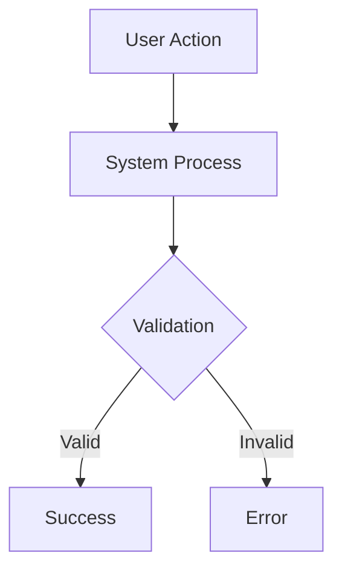

# Specification — `<Feature Name>`
<!-- Template Version: 1.0 | Contract: v1.0 | Last Updated: 2026-02-01 -->
<!-- 🇻🇳 Vietnamese first, 🇬🇧 English follows — for easy scanning -->

---

## TL;DR

| Aspect | Value |
|--------|-------|
| Feature | `<name>` |
| Status | Draft / In Review / Approved |
| Functional Requirements | `<N>` |
| Non-Functional Requirements | `<M>` |
| Affected Roots | `<root1>`, `<root2>` |

---

## 1. Overview

🇻🇳 Mô tả ngắn gọn tính năng này làm gì và tại sao cần thiết. Spec này định nghĩa các yêu cầu chi tiết để triển khai.

🇬🇧 Brief description of what this feature does and why it's needed. This spec defines the detailed requirements for implementation.

---

## 2. Goals & Non-Goals

### Goals

🇻🇳
1. **Mục tiêu 1:** Mô tả mục tiêu đầu tiên
2. **Mục tiêu 2:** Mô tả mục tiêu thứ hai

🇬🇧
1. **Goal 1:** Description of first goal
2. **Goal 2:** Description of second goal

### Non-Goals

🇻🇳
1. Tính năng này KHÔNG làm gì
2. Mục ngoài phạm vi

🇬🇧
1. What this feature explicitly does NOT do
2. Out of scope item

---

## 3. User Stories

### US-001: `<Title>`

🇻🇳 Là `<vai trò>`, tôi muốn `<hành động>`, để `<lợi ích>`.

🇬🇧 As a `<role>`, I want `<action>`, so that `<benefit>`.

### US-002: `<Title>`

🇻🇳 Là `<vai trò>`, tôi muốn `<hành động>`, để `<lợi ích>`.

🇬🇧 As a `<role>`, I want `<action>`, so that `<benefit>`.

---

## 4. Requirements Matrix

| ID | Title | Priority | Type | Covered By |
|----|-------|----------|------|------------|
| FR-001 | `<title>` | Must | Functional | TC-001 |
| FR-002 | `<title>` | Should | Functional | TC-002 |
| NFR-001 | `<title>` | Must | Performance | TC-P01 |

---

## 5. Functional Requirements

### FR-001: `<Title>`

| Aspect | Detail |
|--------|--------|
| Priority | Must / Should / Could |
| Affected Roots | `<roots>` |

#### Description

🇻🇳 Mô tả chi tiết yêu cầu này bao gồm những gì. Giải thích rõ ràng behavior mong đợi.

🇬🇧 Detailed description of what this requirement entails. Clearly explain the expected behavior.

#### Acceptance Criteria

- [ ] AC1: Criterion 1
- [ ] AC2: Criterion 2
- [ ] AC3: Criterion 3

---

### FR-002: `<Title>`

| Aspect | Detail |
|--------|--------|
| Priority | Must / Should / Could |
| Affected Roots | `<roots>` |

#### Description

🇻🇳 Mô tả chi tiết yêu cầu này.

🇬🇧 Detailed description of this requirement.

#### Acceptance Criteria

- [ ] AC1: Criterion 1

---

### FR-003: `<Title>`

| Aspect | Detail |
|--------|--------|
| Priority | Must / Should / Could |
| Affected Roots | `<roots>` |

#### Description

🇻🇳 Mô tả chi tiết.

🇬🇧 Detailed description.

#### Acceptance Criteria

- [ ] AC1: Criterion 1

---

## 6. Non-Functional Requirements

### NFR-001: Performance

| Aspect | Detail |
|--------|--------|
| Category | Performance |
| Metric | Response time < 200ms for 95th percentile |
| Target | 95% of requests |

#### Description

🇻🇳 Hệ thống phải phản hồi trong X giây dưới tải Y. Giải thích tại sao performance quan trọng.

🇬🇧 The system must respond within X seconds under Y load. Explain why performance matters.

---

### NFR-002: Security

| Aspect | Detail |
|--------|--------|
| Category | Security |
| Metric | `<metric>` |

#### Description

🇻🇳 Mô tả yêu cầu bảo mật và lý do.

🇬🇧 Describe security requirement and rationale.

---

## 7. User Flow

| Step | Action | System Response | Next Step |
|------|--------|-----------------|-----------|
| 1 | User clicks X | Show modal | 2 |
| 2 | User enters data | Validate input | 3 or Error |
| 3 | User submits | Save & confirm | End |

### Flow Diagram



---

## 8. Data Models

```typescript
// Entity definitions
interface Entity {
  id: string;
  field1: type;
  field2: type;
  createdAt: Date;
  updatedAt: Date;
}

enum Status {
  ACTIVE = 'active',
  INACTIVE = 'inactive'
}
```

---

## 9. API Contracts

### GET /api/v1/resource

```typescript
// Request
interface GetResourceRequest {
  id: string;
  filters?: { status?: Status };
}

// Response (200)
interface GetResourceResponse {
  status: 'success';
  data: Entity;
}

// Error Response (4xx/5xx)
interface ErrorResponse {
  status: 'error';
  message: string;
  code: string;
}
```

### POST /api/v1/resource

```typescript
// Request
interface CreateResourceRequest {
  field1: type;
  field2: type;
}

// Response (201)
interface CreateResourceResponse {
  status: 'success';
  data: { id: string };
}
```

---

## 10. Edge Cases

| ID | Scenario | Expected Behavior | Priority |
|----|----------|-------------------|----------|
| EC-001 | `<scenario>` | `<behavior>` | Must handle |
| EC-002 | `<scenario>` | `<behavior>` | Should handle |

### EC-001: `<Scenario Title>`

🇻🇳
**Khi:** Mô tả điều kiện xảy ra
**Thì:** Hành vi mong đợi của hệ thống
**Lý do:** Tại sao điều này quan trọng

🇬🇧
**When:** Describe the condition
**Then:** Expected system behavior
**Rationale:** Why this matters

---

## 11. Error Handling

| Error Condition | User Message | System Action |
|-----------------|--------------|---------------|
| Invalid input | "Please check your input" | Log warning, return 400 |
| Server error | "Something went wrong" | Log error, return 500 |

---

## 12. Cross-Root Impact

| Root | Changes | Sync Required |
|------|---------|---------------|
| `<root1>` | `<description>` | Yes / No |
| `<root2>` | `<description>` | Yes / No |

### Integration Points

🇻🇳 Giải thích cách các roots tương tác, dependencies, và những lưu ý khi đồng bộ.

🇬🇧 Explain how roots interact, dependencies, and synchronization considerations.

---

## 13. Dependencies

| Dependency | Type | Status |
|------------|------|--------|
| `<package>` | Package | New / Existing |
| `<service>` | External Service | Ready / Blocked |

---

## 14. Risks & Assumptions

### Risks

| Risk | Impact | Mitigation |
|------|--------|------------|
| `<risk>` | High/Med/Low | `<mitigation>` |

### Assumptions

| # | Assumption | Validated |
|---|------------|-----------|
| 1 | `<assumption>` | Yes / No / Pending |

---

## 15. Open Questions

| # | Question | Status | Answer |
|---|----------|--------|--------|
| 1 | `<question>` | Open / Resolved | `<answer>` |

---

## 16. Notes

🇻🇳
- Ghi chú triển khai hoặc lưu ý quan trọng
- Những điều cần cẩn thận

🇬🇧
- Implementation notes or important considerations
- Things to be careful about

---

## Approval

| Role | Name | Status | Date |
|------|------|--------|------|
| Author | ... | ✅ Done | ... |
| Tech Reviewer | ... | ⏳ Pending | ... |
| Product Owner | ... | ⏳ Pending | ... |

---

## Next Step

🇻🇳 Sau khi phê duyệt, tiến hành **Phase 2: Task Planning**.

🇬🇧 After approval, proceed to **Phase 2: Task Planning**.

Reply: `approved` or `revise: <feedback>`
