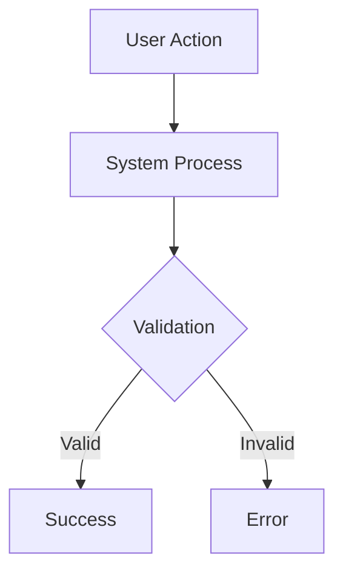

# Specification / Đặc tả Kỹ thuật
# Template v2.0 - Bilingual inline format

---

## 📋 TL;DR

| Aspect / Khía cạnh | Detail / Chi tiết |
|-------------------|-------------------|
| Feature / Tính năng | `<name>` |
| Status / Trạng thái | Draft / Bản nháp |
| Requirements / Yêu cầu | `<N>` functional, `<M>` non-functional |
| Edge Cases / Trường hợp biên | `<X>` identified |
| Affected Roots / Roots ảnh hưởng | `<root1>`, `<root2>` |

---

## 1. Overview / Tổng quan

### 1.1 Summary / Tóm tắt

**EN:**
> Brief description of what this feature does

**VI:**
> Mô tả ngắn gọn tính năng này làm gì

### 1.2 Goals / Mục tiêu

| # | Goal / Mục tiêu |
|---|-----------------|
| 1 | EN: ... / VI: ... |
| 2 | EN: ... / VI: ... |

### 1.3 Non-Goals / Không thuộc Mục tiêu

| # | Non-Goal / Không thuộc mục tiêu |
|---|--------------------------------|
| 1 | EN: ... / VI: ... |
| 2 | EN: ... / VI: ... |

---

## 2. User Stories

| # | Story | Priority / Ưu tiên |
|---|-------|-------------------|
| 1 | **EN:** As a `<role>`, I want `<action>`, so that `<benefit>` | Must / Should / Could |
|   | **VI:** Là `<vai trò>`, tôi muốn `<hành động>`, để `<lợi ích>` | |
| 2 | **EN:** As a ... | |
|   | **VI:** Là ... | |

---

## 3. Functional Requirements / Yêu cầu Chức năng

### FR-001: `<Title>`

| Aspect | Detail |
|--------|--------|
| Description / Mô tả | EN: ... / VI: ... |
| Priority / Ưu tiên | Must / Should / Could |
| Acceptance Criteria / Tiêu chí nghiệm thu | |

**Acceptance Criteria / Tiêu chí nghiệm thu:**
- [ ] EN: ... / VI: ...
- [ ] EN: ... / VI: ...

### FR-002: `<Title>`

| Aspect | Detail |
|--------|--------|
| Description / Mô tả | EN: ... / VI: ... |
| Priority / Ưu tiên | Must / Should / Could |

**Acceptance Criteria / Tiêu chí nghiệm thu:**
- [ ] EN: ... / VI: ...

---

## 4. Non-Functional Requirements / Yêu cầu Phi Chức năng

### NFR-001: `<Title>` (e.g., Performance / Hiệu năng)

| Aspect | Detail |
|--------|--------|
| Description / Mô tả | EN: ... / VI: ... |
| Metric / Chỉ số đo | ... |
| Target / Mục tiêu | ... |

---

## 5. Scope / Phạm vi

### 5.1 In Scope / Trong phạm vi

| # | Item / Hạng mục |
|---|-----------------|
| 1 | EN: ... / VI: ... |
| 2 | EN: ... / VI: ... |

### 5.2 Out of Scope / Ngoài phạm vi

| # | Item / Hạng mục | Reason / Lý do |
|---|-----------------|----------------|
| 1 | EN: ... / VI: ... | ... |

---

## 6. UX / Flow / Luồng xử lý

### 6.1 User Flow / Luồng Người dùng

| Step | Action / Hành động | Expected Result / Kết quả mong đợi |
|------|--------------------|------------------------------------|
| 1 | EN: ... / VI: ... | EN: ... / VI: ... |
| 2 | EN: ... / VI: ... | EN: ... / VI: ... |

### 6.2 Flow Diagram / Sơ đồ Luồng



---

## 7. Data & Contracts / Dữ liệu & Hợp đồng

### 7.1 Entities / Thực thể

| Entity | Fields / Trường | Description / Mô tả |
|--------|-----------------|---------------------|
| `<EntityName>` | `field1: type` | EN: ... / VI: ... |
|                | `field2: type` | EN: ... / VI: ... |

### 7.2 API Endpoints

| Method | Endpoint | Description / Mô tả |
|--------|----------|---------------------|
| `GET` | `/api/v1/...` | EN: ... / VI: ... |
| `POST` | `/api/v1/...` | EN: ... / VI: ... |

**Request / Response Examples:**
```json
// Request
{
  "field": "value"
}

// Response
{
  "status": "success",
  "data": {}
}
```

---

## 8. Cross-Root Impact / Ảnh hưởng Đa Root

### 8.1 Changes per Root / Thay đổi theo Root

#### Root: `<root-name>`

| Type / Loại | Path / Đường dẫn | Description / Mô tả |
|-------------|------------------|---------------------|
| New / Mới | `<file-path>` | EN: ... / VI: ... |
| Modify / Sửa | `<file-path>` | EN: ... / VI: ... |

**Conventions to follow / Quy ước cần tuân theo:**
- From `WORKSPACE_CONTEXT.md`: ...

#### Root: `<root-name-2>`

| Type / Loại | Path / Đường dẫn | Description / Mô tả |
|-------------|------------------|---------------------|
| ... | ... | ... |

### 8.2 Sync Requirements / Yêu cầu Đồng bộ

| From / Từ | To / Đến | Sync Type / Loại đồng bộ | Reason / Lý do |
|-----------|----------|-------------------------|----------------|
| `<root1>` | `<root2>` | Immediate / Versioned / None | EN: ... / VI: ... |

---

## 9. Edge Cases / Trường hợp Biên

| # | Scenario / Tình huống | Expected Behavior / Hành vi mong đợi |
|---|----------------------|-------------------------------------|
| 1 | EN: ... / VI: ... | EN: ... / VI: ... |
| 2 | EN: ... / VI: ... | EN: ... / VI: ... |

---

## 10. Risks & Mitigations / Rủi ro & Giảm thiểu

| Risk / Rủi ro | Likelihood / Khả năng | Impact / Tác động | Mitigation / Giảm thiểu |
|---------------|----------------------|-------------------|------------------------|
| EN: ... / VI: ... | Low/Med/High | Low/Med/High | EN: ... / VI: ... |

---

## 11. Assumptions / Giả định

| # | Assumption / Giả định | Validated / Đã xác nhận |
|---|-----------------------|------------------------|
| 1 | EN: ... / VI: ... | Yes / No / Pending |

---

## 12. Open Questions / Câu hỏi Mở

| # | Question / Câu hỏi | Status / Trạng thái | Answer / Trả lời |
|---|-------------------|---------------------|------------------|
| 1 | EN: ... / VI: ... | Open / Resolved | ... |

---

## 13. Dependencies / Phụ thuộc

| Dependency / Phụ thuộc | Type / Loại | Status / Trạng thái |
|------------------------|-------------|---------------------|
| EN: ... / VI: ... | External / Internal | Ready / Blocked |

---

## Approval / Phê duyệt

| Role / Vai trò | Name / Tên | Status / Trạng thái | Date / Ngày |
|----------------|------------|---------------------|-------------|
| Author / Tác giả | ... | ✅ Done | ... |
| Tech Reviewer | ... | ⏳ Pending | ... |
| Product Owner | ... | ⏳ Pending | ... |

---

## Next Step / Bước tiếp theo

> After approval, proceed to Phase 2 (Task Planning)
> Sau khi phê duyệt, tiến hành Phase 2 (Lập kế hoạch Task)

Reply / Trả lời: `approved` or `revise: <feedback>`
