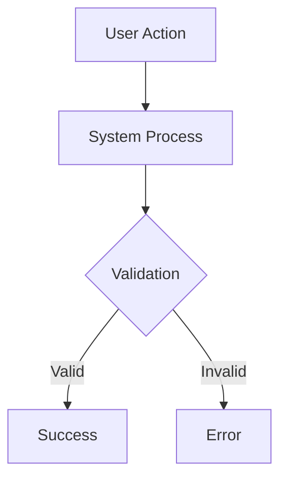

# Specification
# Template v3.0 - Hybrid Bilingual Format (Shared Data + Language Zones)

---

## 📊 SHARED DATA
<!-- Technical data - no translation needed / Dữ liệu kỹ thuật - không cần dịch -->

### TL;DR

| Aspect | Value |
|--------|-------|
| Feature | `<name>` |
| Status | Draft / In Review / Approved |
| Functional Requirements | `<N>` |
| Non-Functional Requirements | `<M>` |
| Edge Cases | `<X>` identified |
| Affected Roots | `<root1>`, `<root2>` |

### Requirements Matrix

| ID | Title | Priority | Type | Covered By |
|----|-------|----------|------|------------|
| FR-001 | `<title>` | Must / Should / Could | Functional | TC-001, TC-002 |
| FR-002 | `<title>` | Must / Should / Could | Functional | TC-003 |
| NFR-001 | `<title>` | Must / Should / Could | Performance | TC-P01 |
| NFR-002 | `<title>` | Must / Should / Could | Security | TC-S01 |

### Scope Boundaries

| In Scope | Out of Scope |
|----------|--------------|
| `<item-1>` | `<item-1>` |
| `<item-2>` | `<item-2>` |

### User Flow

| Step | Action | System Response | Next Step |
|------|--------|-----------------|-----------|
| 1 | User clicks X | Show modal | 2 |
| 2 | User enters data | Validate input | 3 or Error |
| 3 | User submits | Save & confirm | End |

### Flow Diagram



### Data Models

```typescript
// Entity definitions
interface Entity {
  id: string;
  field1: type;
  field2: type;
  createdAt: Date;
  updatedAt: Date;
}

enum Status {
  ACTIVE = 'active',
  INACTIVE = 'inactive'
}
```

### API Contracts

#### Endpoint: `GET /api/v1/resource`

```typescript
// Request
interface GetResourceRequest {
  id: string;
  filters?: {
    status?: Status;
  };
}

// Response
interface GetResourceResponse {
  status: 'success' | 'error';
  data: Entity;
}
```

#### Endpoint: `POST /api/v1/resource`

```typescript
// Request
interface CreateResourceRequest {
  field1: type;
  field2: type;
}

// Response
interface CreateResourceResponse {
  status: 'success' | 'error';
  data: {
    id: string;
  };
}
```

### Changes by Root

#### Root: `<root-name>`

| Type | Path | FR Covered |
|------|------|------------|
| Create | `<file-path>` | FR-001 |
| Modify | `<file-path>` | FR-002 |

#### Root: `<root-name-2>`

| Type | Path | FR Covered |
|------|------|------------|
| Create | `<file-path>` | FR-001 |

### Sync Requirements

| From | To | Type | Trigger |
|------|-----|------|---------|
| `<root1>` | `<root2>` | Immediate / Versioned | On deploy / On change |

### Edge Cases Matrix

| ID | Scenario | Expected Behavior | Priority |
|----|----------|-------------------|----------|
| EC-001 | `<scenario>` | `<behavior>` | Must handle |
| EC-002 | `<scenario>` | `<behavior>` | Should handle |

### Risks

| Risk | Likelihood | Impact | Mitigation |
|------|------------|--------|------------|
| `<risk-1>` | Low/Med/High | Low/Med/High | `<mitigation>` |

### Assumptions

| # | Assumption | Validated |
|---|------------|-----------|
| 1 | `<assumption>` | Yes / No / Pending |

### Open Questions

| # | Question | Status | Answer |
|---|----------|--------|--------|
| 1 | `<question>` | Open / Resolved | `<answer>` |

### Dependencies

| Dependency | Type | Status |
|------------|------|--------|
| `<dependency>` | External / Internal | Ready / Blocked |

### Approval Status

| Role | Name | Status | Date |
|------|------|--------|------|
| Author | ... | ✅ Done | ... |
| Tech Reviewer | ... | ⏳ Pending | ... |
| Product Owner | ... | ⏳ Pending | ... |

---

## 🇬🇧 ENGLISH

### 1. Overview

> Brief description of what this feature does and why it's needed.
> This spec defines the detailed requirements for implementation.

### 2. Goals

1. **Goal 1:** Description of first goal
2. **Goal 2:** Description of second goal

### 3. Non-Goals

1. **Non-Goal 1:** What this feature explicitly does NOT do
2. **Non-Goal 2:** Out of scope item

### 4. User Stories

#### US-001: `<Title>`
> As a `<role>`, I want `<action>`, so that `<benefit>`.

#### US-002: `<Title>`
> As a `<role>`, I want `<action>`, so that `<benefit>`.

### 5. Functional Requirements

#### FR-001: `<Title>`

**Description:** Detailed description of what this requirement entails.

**Acceptance Criteria:**
- [ ] Criterion 1
- [ ] Criterion 2
- [ ] Criterion 3

#### FR-002: `<Title>`

**Description:** ...

**Acceptance Criteria:**
- [ ] Criterion 1

### 6. Non-Functional Requirements

#### NFR-001: Performance

**Description:** The system must respond within X seconds under Y load.

**Metric:** Response time < 200ms for 95th percentile
**Target:** 95% of requests

#### NFR-002: Security

**Description:** ...

### 7. Edge Cases

#### EC-001: `<Scenario>`

**When:** Describe the condition
**Then:** Expected system behavior
**Rationale:** Why this matters

#### EC-002: `<Scenario>`

**When:** ...
**Then:** ...

### 8. Error Handling

| Error Condition | User Message | System Action |
|-----------------|--------------|---------------|
| Invalid input | "Please check your input" | Log warning, return 400 |
| Server error | "Something went wrong" | Log error, return 500 |

### 9. Notes

- Additional context or implementation hints
- Things to be careful about

---

## 🇻🇳 TIẾNG VIỆT

### 1. Tổng quan

> Mô tả ngắn gọn tính năng này làm gì và tại sao cần thiết.
> Spec này định nghĩa các yêu cầu chi tiết để triển khai.

### 2. Mục tiêu

1. **Mục tiêu 1:** Mô tả mục tiêu đầu tiên
2. **Mục tiêu 2:** Mô tả mục tiêu thứ hai

### 3. Không thuộc Mục tiêu

1. **Không phải mục tiêu 1:** Tính năng này KHÔNG làm gì
2. **Không phải mục tiêu 2:** Mục ngoài phạm vi

### 4. User Stories

#### US-001: `<Tiêu đề>`
> Là `<vai trò>`, tôi muốn `<hành động>`, để `<lợi ích>`.

#### US-002: `<Tiêu đề>`
> Là `<vai trò>`, tôi muốn `<hành động>`, để `<lợi ích>`.

### 5. Yêu cầu Chức năng

#### FR-001: `<Tiêu đề>`

**Mô tả:** Mô tả chi tiết yêu cầu này bao gồm những gì.

**Tiêu chí Nghiệm thu:**
- [ ] Tiêu chí 1
- [ ] Tiêu chí 2
- [ ] Tiêu chí 3

#### FR-002: `<Tiêu đề>`

**Mô tả:** ...

**Tiêu chí Nghiệm thu:**
- [ ] Tiêu chí 1

### 6. Yêu cầu Phi Chức năng

#### NFR-001: Hiệu năng

**Mô tả:** Hệ thống phải phản hồi trong X giây dưới tải Y.

**Chỉ số đo:** Thời gian phản hồi < 200ms cho percentile 95
**Mục tiêu:** 95% requests

#### NFR-002: Bảo mật

**Mô tả:** ...

### 7. Trường hợp Biên

#### EC-001: `<Tình huống>`

**Khi:** Mô tả điều kiện
**Thì:** Hành vi mong đợi của hệ thống
**Lý do:** Tại sao điều này quan trọng

#### EC-002: `<Tình huống>`

**Khi:** ...
**Thì:** ...

### 8. Xử lý Lỗi

| Điều kiện Lỗi | Thông báo cho User | Hành động Hệ thống |
|---------------|--------------------|--------------------|
| Input không hợp lệ | "Vui lòng kiểm tra dữ liệu" | Log warning, trả về 400 |
| Lỗi server | "Đã xảy ra lỗi" | Log error, trả về 500 |

### 9. Ghi chú

- Ngữ cảnh bổ sung hoặc gợi ý triển khai
- Những điều cần lưu ý

---

## ⏭️ Next Step

> After approval, proceed to Phase 2 (Task Planning)
> Sau khi phê duyệt, tiến hành Phase 2 (Lập kế hoạch Task)

Reply: `approved` or `revise: <feedback>`
