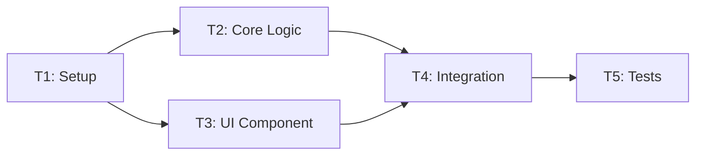

# Task Plan / Kế hoạch Task
# Template v2.0 - Bilingual inline format

---

## 📋 TL;DR

| Aspect / Khía cạnh | Detail / Chi tiết |
|-------------------|-------------------|
| Feature / Tính năng | `<name>` |
| Total Tasks / Tổng số Task | `<N>` |
| Estimated Effort / Ước lượng | `<time>` |
| Affected Roots / Roots ảnh hưởng | `<root1>`, `<root2>` |
| Execution Order / Thứ tự thực hiện | T1 → T2 → T3 → ... |

---

## 1. Goal / Mục tiêu

**EN:**
> Brief description of what will be accomplished

**VI:**
> Mô tả ngắn gọn những gì sẽ đạt được

---

## 2. Task Overview / Tổng quan Task

| ID | Title / Tiêu đề | Root | Type / Loại | Est. / Ước lượng | Deps / Phụ thuộc |
|----|-----------------|------|-------------|------------------|------------------|
| T1 | ... | `<root>` | New / Modify | 1h | - |
| T2 | ... | `<root>` | New / Modify | 2h | T1 |
| T3 | ... | `<root>` | New / Modify | 1h | T1, T2 |

**Legend / Chú thích:**
- Type: `New` = Create new files / Tạo mới, `Modify` = Change existing / Sửa đổi, `Delete` = Remove / Xóa, `Test` = Write tests / Viết test

---

## 3. Execution Order / Thứ tự Thực hiện



---

## 4. Tasks by Root / Task theo Root

### Root: `<root-name>`

#### T1 — `<Title / Tiêu đề>`

| Aspect | Detail |
|--------|--------|
| **Description / Mô tả** | EN: ... / VI: ... |
| **Type / Loại** | New / Modify / Delete |
| **Estimated / Ước lượng** | ... |
| **Dependencies / Phụ thuộc** | None / T<N> |

**Files / Tệp:**

| Action / Hành động | Path / Đường dẫn |
|-------------------|------------------|
| Create / Tạo | `<file-path>` |
| Modify / Sửa | `<file-path>` |

**Implementation / Triển khai:**

| Aspect | Detail |
|--------|--------|
| Function/Class | `<name>` |
| Purpose / Mục đích | EN: ... / VI: ... |
| Inputs / Đầu vào | `<type>`: description |
| Outputs / Đầu ra | `<type>`: description |
| Side Effects / Tác dụng phụ | EN: ... / VI: ... |

**Contracts / Hợp đồng:**
```typescript
// Interface or API contract
interface Example {
  field: type;
}
```

**Done Criteria / Tiêu chí Hoàn thành:**
- [ ] EN: ... / VI: ...
- [ ] EN: ... / VI: ...

**Verification Steps / Bước Kiểm tra:**
1. EN: ... / VI: ...
2. EN: ... / VI: ...

---

#### T2 — `<Title / Tiêu đề>`

| Aspect | Detail |
|--------|--------|
| **Description / Mô tả** | EN: ... / VI: ... |
| **Type / Loại** | New / Modify / Delete |
| **Estimated / Ước lượng** | ... |
| **Dependencies / Phụ thuộc** | T1 |

**Files / Tệp:**

| Action / Hành động | Path / Đường dẫn |
|-------------------|------------------|
| Create / Tạo | `<file-path>` |

**Implementation / Triển khai:**

| Aspect | Detail |
|--------|--------|
| Function/Class | `<name>` |
| Purpose / Mục đích | EN: ... / VI: ... |
| Inputs / Đầu vào | ... |
| Outputs / Đầu ra | ... |

**Done Criteria / Tiêu chí Hoàn thành:**
- [ ] EN: ... / VI: ...

**Verification Steps / Bước Kiểm tra:**
1. EN: ... / VI: ...

---

### Root: `<root-name-2>`

#### T3 — `<Title / Tiêu đề>`

(Same structure as above / Cấu trúc tương tự như trên)

---

## 5. Cross-Root Integration Tasks / Task Tích hợp Đa Root

### T<N> — Integration: `<root1>` ↔ `<root2>`

| Aspect | Detail |
|--------|--------|
| **Description / Mô tả** | EN: Integration between roots / VI: Tích hợp giữa các roots |
| **Type / Loại** | Integration |
| **Dependencies / Phụ thuộc** | T<X>, T<Y> |

**Integration Points / Điểm Tích hợp:**

| From / Từ | To / Đến | Contract / Hợp đồng |
|-----------|----------|---------------------|
| `<root1>/<file>` | `<root2>/<file>` | Package / API / Event |

**Verification / Kiểm tra:**
- [ ] EN: Test integration flow / VI: Test luồng tích hợp
- [ ] EN: Verify data consistency / VI: Kiểm tra tính nhất quán dữ liệu

---

## 6. Rollback Plan / Kế hoạch Hoàn tác

| Task | Rollback Action / Hành động Hoàn tác |
|------|-------------------------------------|
| T1 | EN: ... / VI: ... |
| T2 | EN: ... / VI: ... |

---

## 7. Risk per Task / Rủi ro theo Task

| Task | Risk / Rủi ro | Mitigation / Giảm thiểu |
|------|---------------|------------------------|
| T1 | EN: ... / VI: ... | EN: ... / VI: ... |

---

## Approval / Phê duyệt

| Role / Vai trò | Name / Tên | Status / Trạng thái | Date / Ngày |
|----------------|------------|---------------------|-------------|
| Author / Tác giả | ... | ✅ Done | ... |
| Reviewer | ... | ⏳ Pending | ... |

---

## Next Step / Bước tiếp theo

> After approval, proceed to Phase 3 (Implementation)
> Sau khi phê duyệt, tiến hành Phase 3 (Triển khai)

Reply / Trả lời: `approved` or `revise: <feedback>`
