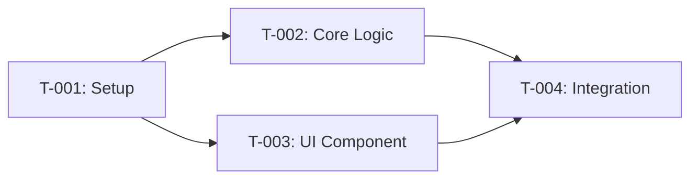

# Task Plan — `<Feature Name>`
<!-- Template v4.0 | Inline Bilingual Format with Visual Flags -->
<!-- 🇻🇳 Vietnamese first, 🇬🇧 English follows — for easy scanning -->

---

## TL;DR

| Aspect | Value |
|--------|-------|
| Feature | `<name>` |
| Total Tasks | `<N>` |
| Estimated Effort | `<time>` |
| Affected Roots | `<root1>`, `<root2>` |

---

## 1. Goal

🇻🇳 Mô tả ngắn gọn những gì sẽ đạt được khi tất cả task hoàn thành.

🇬🇧 Brief description of what will be accomplished when all tasks are complete.

---

## 2. Task Overview

| ID | Title | Root | Type | Est. | Deps | Status |
|----|-------|------|------|------|------|--------|
| T-001 | `<title>` | `<root>` | New | 1h | - | ⏳ |
| T-002 | `<title>` | `<root>` | Modify | 2h | T-001 | ⏳ |
| T-003 | `<title>` | `<root>` | New | 1h | T-001 | ⏳ |

**Legend:**
- Type: `New` = Create new, `Modify` = Change existing, `Delete` = Remove
- Status: ⏳ Pending, 🔄 In Progress, ✅ Done, ❌ Blocked

---

## 3. Execution Flow



---

## 4. Task Details

### T-001 — `<Title>`

| Aspect | Detail |
|--------|--------|
| Root | `<root-name>` |
| Type | New / Modify / Delete |
| Estimated | `<time>` |
| Dependencies | None |
| FR Covered | FR-001, FR-002 |

#### Description

🇻🇳 Mô tả chi tiết task này làm gì, tại sao cần thiết, và cách triển khai.

🇬🇧 Detailed description of what this task does, why it's needed, and how to implement.

#### Files

| Action | Path |
|--------|------|
| Create | `<file-path>` |
| Modify | `<file-path>` |

#### Implementation

🇻🇳 Ghi chú triển khai chi tiết, các điểm cần lưu ý, edge cases cần xử lý.

🇬🇧 Detailed implementation notes, points to watch out for, edge cases to handle.

```typescript
// Key code snippet or interface
interface Example {
  field: type;
}
```

#### Done Criteria

- [ ] Criterion 1
- [ ] Criterion 2

#### Verification

```bash
# Commands to verify
pnpm lint
pnpm test
```

---

### T-002 — `<Title>`

| Aspect | Detail |
|--------|--------|
| Root | `<root-name>` |
| Type | New / Modify / Delete |
| Estimated | `<time>` |
| Dependencies | T-001 |
| FR Covered | FR-001 |

#### Description

🇻🇳 Mô tả chi tiết task này.

🇬🇧 Detailed description of this task.

#### Files

| Action | Path |
|--------|------|
| Create | `<file-path>` |

#### Implementation

🇻🇳 Ghi chú triển khai chi tiết.

🇬🇧 Detailed implementation notes.

```typescript
// Key code snippet
```

#### Done Criteria

- [ ] Criterion 1

#### Verification

```bash
# Commands
```

---

### T-003 — `<Title>`

| Aspect | Detail |
|--------|--------|
| Root | `<root-name>` |
| Type | New / Modify / Delete |
| Estimated | `<time>` |
| Dependencies | T-001 |
| FR Covered | FR-002 |

#### Description

🇻🇳 Mô tả chi tiết task này.

🇬🇧 Detailed description of this task.

#### Files

| Action | Path |
|--------|------|
| Create | `<file-path>` |

#### Implementation

🇻🇳 Ghi chú triển khai chi tiết.

🇬🇧 Detailed implementation notes.

#### Done Criteria

- [ ] Criterion 1

---

## 5. Cross-Root Integration Tasks

### T-00X — Integration: `<root1>` ↔ `<root2>`

| Aspect | Detail |
|--------|--------|
| Type | Integration |
| Dependencies | T-00Y, T-00Z |

#### Description

🇻🇳 Giải thích cách các roots tích hợp với nhau và những lưu ý.

🇬🇧 Explain how roots integrate and any considerations.

#### Integration Points

| From | To | Contract |
|------|-----|----------|
| `<root1>/<file>` | `<root2>/<file>` | Package / API / Event |

#### Verification

- [ ] Integration flow works end-to-end
- [ ] Data consistency verified

---

## 6. Requirements Coverage

| Requirement | Tasks | Status |
|-------------|-------|--------|
| FR-001 | T-001, T-002 | ⬜ |
| FR-002 | T-003 | ⬜ |
| NFR-001 | T-002 | ⬜ |

---

## 7. Risk per Task

| Task | Risk | Mitigation |
|------|------|------------|
| T-001 | `<risk>` | `<mitigation>` |
| T-002 | `<risk>` | `<mitigation>` |

---

## 8. Rollback Plan

| Task | Rollback Action |
|------|-----------------|
| T-001 | `git revert` or delete created files |
| T-002 | Restore from backup / revert changes |

---

## 9. Environment Requirements

🇻🇳 Liệt kê các biến môi trường hoặc setup cần có trước khi bắt đầu.

🇬🇧 List environment variables or setup needed before starting.

```env
# Required before starting
VARIABLE_NAME=value
```

---

## 10. Open Questions

🇻🇳
- Câu hỏi 1: ...
- Câu hỏi 2: ...

🇬🇧
- Question 1: ...
- Question 2: ...

---

## Approval

| Role | Name | Status | Date |
|------|------|--------|------|
| Author | ... | ✅ Done | ... |
| Reviewer | ... | ⏳ Pending | ... |

---

## Next Step

🇻🇳 Sau khi phê duyệt, tiến hành **Phase 3: Implementation**.

🇬🇧 After approval, proceed to **Phase 3: Implementation**.

Reply: `approved` or `revise: <feedback>`
