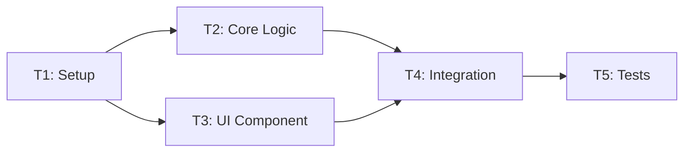

# Task Plan
# Template v3.0 - Hybrid Bilingual Format (Shared Data + Language Zones)

---

## 📊 SHARED DATA
<!-- Technical data - no translation needed / Dữ liệu kỹ thuật - không cần dịch -->

### TL;DR

| Aspect | Value |
|--------|-------|
| Feature | `<name>` |
| Total Tasks | `<N>` |
| Estimated Effort | `<time>` |
| Affected Roots | `<root1>`, `<root2>` |
| Execution Order | T1 → T2 → T3 → ... |

### Task Overview

| ID | Title | Root | Type | Est. | Deps | Status |
|----|-------|------|------|------|------|--------|
| T1 | `<title>` | `<root>` | New | 1h | - | ⏳ |
| T2 | `<title>` | `<root>` | Modify | 2h | T1 | ⏳ |
| T3 | `<title>` | `<root>` | New | 1h | T1, T2 | ⏳ |
| T4 | `<title>` | `<root>` | Test | 1h | T1-T3 | ⏳ |

**Legend:**
- Type: `New` = Create new, `Modify` = Change existing, `Delete` = Remove, `Test` = Write tests
- Status: ⏳ Pending, 🔄 In Progress, ✅ Done, ❌ Blocked

### Execution Flow



---

### Task Details

#### T1 — `<Title>`

| Aspect | Value |
|--------|-------|
| Root | `<root-name>` |
| Type | New / Modify / Delete |
| Estimated | `<time>` |
| Dependencies | None / T`<N>` |
| FR Covered | FR-001, FR-002 |

**Files:**

| Action | Path |
|--------|------|
| Create | `<file-path>` |
| Modify | `<file-path>` |

**Contracts:**

```typescript
// Interface or function signature
interface Example {
  field: type;
}

function doSomething(input: Type): ReturnType {
  // implementation
}
```

**Done Criteria:**
- [ ] Criterion 1
- [ ] Criterion 2

**Verification:**
```bash
# Commands to verify
pnpm lint
pnpm test -- --filter=<test-pattern>
```

---

#### T2 — `<Title>`

| Aspect | Value |
|--------|-------|
| Root | `<root-name>` |
| Type | New / Modify / Delete |
| Estimated | `<time>` |
| Dependencies | T1 |
| FR Covered | FR-001 |

**Files:**

| Action | Path |
|--------|------|
| Create | `<file-path>` |

**Contracts:**

```typescript
// Interface or function signature
```

**Done Criteria:**
- [ ] Criterion 1

**Verification:**
```bash
# Commands to verify
```

---

#### T3 — `<Title>`

| Aspect | Value |
|--------|-------|
| Root | `<root-name>` |
| Type | New / Modify / Delete |
| Estimated | `<time>` |
| Dependencies | T1 |
| FR Covered | FR-002 |

**Files:**

| Action | Path |
|--------|------|
| Create | `<file-path>` |

**Contracts:**

```typescript
// Interface or function signature
```

**Done Criteria:**
- [ ] Criterion 1

**Verification:**
```bash
# Commands to verify
```

---

### Cross-Root Integration Tasks

#### T`<N>` — Integration: `<root1>` ↔ `<root2>`

| Aspect | Value |
|--------|-------|
| Type | Integration |
| Dependencies | T`<X>`, T`<Y>` |

**Integration Points:**

| From | To | Contract |
|------|-----|----------|
| `<root1>/<file>` | `<root2>/<file>` | Package / API / Event |

**Verification:**
- [ ] Integration flow works end-to-end
- [ ] Data consistency verified

---

### Rollback Plan

| Task | Rollback Action |
|------|-----------------|
| T1 | `git revert` or delete created files |
| T2 | Restore from backup / revert changes |

### Risk per Task

| Task | Risk | Mitigation |
|------|------|------------|
| T1 | `<risk>` | `<mitigation>` |
| T2 | `<risk>` | `<mitigation>` |

### Approval Status

| Role | Name | Status | Date |
|------|------|--------|------|
| Author | ... | ✅ Done | ... |
| Reviewer | ... | ⏳ Pending | ... |

---

## 🇬🇧 ENGLISH

### 1. Goal

> Brief description of what will be accomplished when all tasks are complete.

### 2. Task Descriptions

#### T1 — `<Title>`

**Purpose:** What this task accomplishes and why it's needed.

**Implementation Notes:**
- Key point 1
- Key point 2
- Watch out for: ...

**Side Effects:**
- Effect 1: ...

---

#### T2 — `<Title>`

**Purpose:** ...

**Implementation Notes:**
- ...

---

#### T3 — `<Title>`

**Purpose:** ...

**Implementation Notes:**
- ...

---

### 3. Integration Notes

Explanation of how the tasks connect and any special considerations for cross-root work.

### 4. Risks & Concerns

#### Risk 1: `<Title>`

**Description:** ...

**Mitigation:** ...

### 5. Open Questions

- Question 1: ...
- Question 2: ...

---

## 🇻🇳 TIẾNG VIỆT

### 1. Mục tiêu

> Mô tả ngắn gọn những gì sẽ đạt được khi tất cả task hoàn thành.

### 2. Mô tả Task

#### T1 — `<Tiêu đề>`

**Mục đích:** Task này đạt được gì và tại sao cần thiết.

**Ghi chú Triển khai:**
- Điểm chính 1
- Điểm chính 2
- Cần lưu ý: ...

**Tác dụng phụ:**
- Tác dụng 1: ...

---

#### T2 — `<Tiêu đề>`

**Mục đích:** ...

**Ghi chú Triển khai:**
- ...

---

#### T3 — `<Tiêu đề>`

**Mục đích:** ...

**Ghi chú Triển khai:**
- ...

---

### 3. Ghi chú Tích hợp

Giải thích cách các task kết nối với nhau và các lưu ý đặc biệt cho công việc đa root.

### 4. Rủi ro & Quan ngại

#### Rủi ro 1: `<Tiêu đề>`

**Mô tả:** ...

**Giảm thiểu:** ...

### 5. Câu hỏi Mở

- Câu hỏi 1: ...
- Câu hỏi 2: ...

---

## ⏭️ Next Step

> After approval, proceed to Phase 3 (Implementation)
> Sau khi phê duyệt, tiến hành Phase 3 (Triển khai)

Reply: `approved` or `revise: <feedback>`
